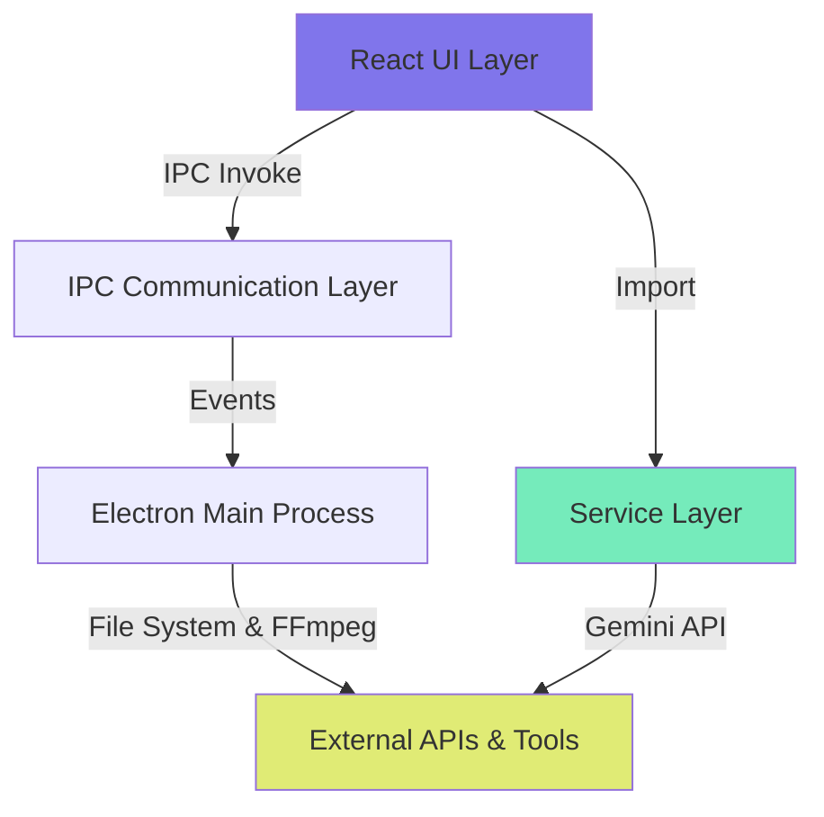

# SUBLIBR - Application Documentation

> **Last Updated**: February 20, 2026  
> **Version**: 1.0.0

---

## Table of Contents

1. [Overview](#overview)
2. [Project Structure](#project-structure)
3. [Technical Architecture](#technical-architecture)
4. [Design System](#design-system)
5. [Components](#components)
6. [Services & Processing](#services--processing)
7. [User Experience](#user-experience)
8. [Subtitle Generation Workflow](#subtitle-generation-workflow)

---

## Overview

**SUBLIBR** is a desktop application that generates high-quality subtitles from audio and video files using multiple AI providers (Google Gemini and OpenAI). The app runs as an Electron desktop application, providing a native experience across macOS, Windows, and Linux platforms.

### Key Features

- **Multi-Provider AI Transcription**: Supports Google Gemini and OpenAI with per-provider API key validation and a unified "Active Model" selector
- **Intelligent Audio Processing**: Automatic silence detection and smart chunking (3-4 minute segments with 20s overlap)
- **Gap Healing**: Detects and re-transcribes missing subtitle segments automatically
- **Quality Enforcement**: Ensures subtitles meet display standards (max 2 lines, 8 words/line, proper duration)
- **Recent Files History**: Tracks the last 10 generated or opened files for quick access, with automatic subtitle caching
- **Subtitle Caching**: Generated subtitles are persisted to `electron-store` and restored when loading a recent file
- **Token Usage Tracking**: Real-time session token counter with cost estimates and per-provider breakdown
- **Multi-Language Support**: 90+ languages with auto-detection capability
- **Built-in Editor**: Timeline-based subtitle editor with video preview and Search/Replace capabilities
- **Search & Replace**: Global search with highlighting, replacement, and keyboard navigation (Cmd/Ctrl+F)
- **Inline Preview**: Toggle between subtitle editor and preview mode (video with overlay or cinema screen for audio)
- **Advanced Timeline Editor**: Two-tier timeline with a zoomed main track and a full-duration minimap for precise navigation and global context.
- **Media Streaming**: Local HTTP server for efficient playback and seeking of large video files, bypassing Electron protocol limitations
- **Versioning & Regenerate**: Create multiple subtitle versions for the same file (e.g., different models/prompts) and switch between them instantly
- **Auto-Update**: Built-in update system via GitHub Releases with user-controlled download and install

### Tech Stack

| Technology | Purpose |
|------------|---------|
| **Electron** | Desktop application framework |
| **React 19** | UI framework with hooks |
| **TypeScript** | Type-safe development |
| **Vite** | Build tool and dev server |
| **Google Gemini / OpenAI** | Speech-to-text transcription (multi-provider) |
| **FFmpeg** | Audio/video processing (extract audio, detect silences, split chunks) |
| **electron-store** | Persistent settings storage |
| **fluent-ffmpeg** | Node.js wrapper for FFmpeg |

---

## Project Structure

```
subtitles-gen/
├── electron/                    # Electron main process
│   ├── main.ts                  # Main process with IPC handlers
│   └── preload.ts              # Preload script (bridge API)
│
├── src/                        # React application source
│   ├── components/             # React components
│   │   ├── AudioPlayer.tsx
│   │   ├── CustomSelect.tsx
│   │   ├── FileUpload.tsx
│   │   ├── LanguageSelector.tsx
│   │   ├── ProgressIndicator.tsx
│   │   ├── RecentFiles.tsx
│   │   ├── Settings.tsx
│   │   ├── ShortcutsModal.tsx
│   │   ├── SubtitleEditor.tsx
│   │   ├── SubtitlePreview.tsx
│   │   ├── Timeline/
│   │   │   ├── Timeline.tsx       # Main timeline orchestrator
│   │   │   ├── Minimap.tsx        # Overview track with zoom slider
│   │   │   ├── MainTrack.tsx      # Zoomed detail track with Ruler & Grid
│   │   │   ├── Minimap.tsx        # Overview track with zoom slider
│   │   │   ├── Ruler.tsx          # Time ruler with comb-style ticks
│   │   │   ├── TimelineGrid.tsx   # Vertical grid lines for alignment
│   │   │   ├── useTimelineTicks.ts # Shared tick generation logic
│   │   │   └── Timeline.css       # Timeline styles
│   │   ├── TokenUsageDisplay.tsx
│   │   └── UpdateNotification.tsx
│   │
│   ├── services/               # Core business logic
│   │   ├── audioProcessor.ts   # Audio chunking & silence detection
│   │   ├── healer.ts          # Gap detection & healing
│   │   ├── providers.ts       # Multi-provider dispatch, API key testing
│   │   └── transcriber.ts     # AI transcription & quality enforcement
│   │
│   ├── assets/                 # Static assets
│   │   └── Fonts/
│   │       └── Signika/       # Custom Signika font
│   │
│   ├── App.tsx                # Main application component
│   ├── App.css                # Global styles & design tokens
│   ├── types.ts               # TypeScript type definitions
│   ├── utils.ts               # Utility functions
│   └── main.tsx               # React app entry point
│
├── public/                     # Static public assets
├── dist/                      # Vite build output
├── dist-electron/             # Electron build output
├── release/                   # Packaged installers
│
├── package.json               # Dependencies & build config
├── tsconfig.json              # TypeScript configuration
├── vite.config.ts             # Vite build configuration
└── README.md                  # Project README

```

### File Counts & Organization

- **React Components**: ~15 files
- **Services**: 4 core modules
- **Electron Process Files**: 2 (main + preload)
- **Total Source Files**: ~15 TypeScript/TSX files
- **Lines of Code**: ~2,500 (excluding dependencies)

---

## Technical Architecture

### Architecture Pattern

The application follows a **layered architecture**:



### 1. **Renderer Process (React UI)**

- **Framework**: React 19 with TypeScript
- **State Management**: Local component state using `useState` and `useEffect` hooks
- **UI Components**: Functional components with hooks pattern
- **Styling**: CSS-in-file with design tokens (CSS custom properties)

### 2. **IPC Communication Layer**

The app uses Electron's IPC (Inter-Process Communication) to bridge the renderer and main processes securely.

**Preload Script** (`electron/preload.ts`) exposes a safe API:

```typescript
window.electronAPI = {
  // Settings & Store
  getStoreValue: (key: string) => ipcRenderer.invoke('store:get', key),
  setStoreValue: (key: string, value: unknown) => ipcRenderer.invoke('store:set', key, value),
  deleteStoreValue: (key: string) => ipcRenderer.invoke('store:delete', key),
  
  // File dialogs
  openFileDialog: () => ipcRenderer.invoke('dialog:openFile'),
  saveFileDialog: (defaultName: string) => ipcRenderer.invoke('dialog:saveFile', defaultName),
  
  // File operations
  readFile: (path: string) => ipcRenderer.invoke('file:read', path),
  writeFile: (path: string, data: string) => ipcRenderer.invoke('file:write', path, data),
  getFileInfo: (path: string) => ipcRenderer.invoke('file:getInfo', path),
  getTempPath: () => ipcRenderer.invoke('file:getTempPath'),
  
  // FFmpeg operations
  extractAudio: (inputPath: string, outputPath: string) => 
    ipcRenderer.invoke('ffmpeg:extractAudio', inputPath, outputPath),
  getDuration: (filePath: string) => 
    ipcRenderer.invoke('ffmpeg:getDuration', filePath),
  detectSilences: (filePath: string, threshold: number, minDuration: number) => 
    ipcRenderer.invoke('ffmpeg:detectSilences', filePath, threshold, minDuration),
  splitAudio: (inputPath: string, chunks: { start: number; end: number; outputPath: string }[]) => 
    ipcRenderer.invoke('ffmpeg:splitAudio', inputPath, chunks),
  
  // Progress events
  onProgress: (callback: (progress: number) => void) => {
    ipcRenderer.on('progress', (_event, progress) => callback(progress));
  },

  // App updates
  getVersion: () => ipcRenderer.invoke('app:getVersion'),
  checkForUpdates: () => ipcRenderer.invoke('app:checkForUpdates'),
  downloadUpdate: () => ipcRenderer.invoke('app:downloadUpdate'),
  installUpdate: () => ipcRenderer.invoke('app:installUpdate'),
  onUpdateAvailable: (callback) => ipcRenderer.on('update-available', (_, info) => callback(info)),
  onUpdateProgress: (callback) => ipcRenderer.on('update-download-progress', (_, progress) => callback(progress)),
  onUpdateDownloaded: (callback) => ipcRenderer.on('update-downloaded', (_, info) => callback(info)),
  onUpdateError: (callback) => ipcRenderer.on('update-error', (_, message) => callback(message)),
}
```

### 3. **Main Process (Electron)**

**File**: `electron/main.ts`

Responsibilities:
- Window management
- IPC handler registration
- File system access (with security validation)
- FFmpeg execution
- Settings persistence via `electron-store`
- Subtitle cache persistence (`subtitle-cache` store key)

**Security Features**:
- Path validation against allowed directories
- Store key allowlist (`settings`, `recent-files`, `subtitle-cache`)
- Content Security Policy (CSP)
- Sandboxed renderer process
- **Media Streaming**: Local HTTP server (`http://localhost:*`)
  - Redirects `media://` requests to local server
  - Supports standard HTTP Range requests for seeking
  - Validates paths against allowed directories
  - Secured via strict CSP and random port assignment

**FFmpeg Integration**:
```typescript
// Uses bundled FFmpeg binaries shipped with the app
// Development: Uses @ffmpeg-installer packages
// Production: Copies binaries to extraResources
```

### 4. **Service Layer**

Four core services handle subtitle processing:

#### **audioProcessor.ts**
- Chunks audio into 3-4 minute segments
- Detects silence using FFmpeg filters
- Adds 20-second overlap between chunks
- Splits audio files using FFmpeg

#### **transcriber.ts**
- Sends audio chunks to Gemini AI
- Parses SRT-formatted responses
- Merges subtitles with "smart stitching" (handles chunk boundaries)
- Enforces subtitle quality standards (min/max duration, reading speed)

#### **healer.ts**
- Identifies gaps in subtitle coverage
- Filters out intentional silences
- Re-transcribes missing segments
- Merges healed subtitles back into timeline

### 5. **External Dependencies**

| API/Tool | Purpose | Configuration |
|----------|---------|---------------|
| **Google Gemini API** | Transcription | API key stored in settings, tested via `GET /v1beta/models` |
| **OpenAI API** | Transcription | Chat Completions API (`v1/chat/completions`) for GPT-4o with Audio input (Standard models mapped internally to `gpt-4o-audio-preview` and `gpt-4o-mini-audio-preview`). Legacy Whisper-1 support as fallback. |
| **FFmpeg** | Audio processing | Bundled binaries (platform-specific) |
| **ffprobe** | Media metadata | Bundled with FFmpeg |
| **electron-updater** | Auto-updates | GitHub Releases backend, check+prompt UX |

---

## Design System

The app uses a **dark theme** with a modern, premium aesthetic built on design tokens defined in [App.css](file:///Users/staskrylov/Documents/Websites/subtitles-gen/src/App.css).

### Color Palette

```css
/* Background Colors */
--color-bg-primary: #0c0a14;      /* Darkest - main background */
--color-bg-secondary: #13111e;    /* Card backgrounds */
--color-bg-tertiary: #1b1828;     /* Input backgrounds */
--color-bg-hover: #231f33;        /* Hover states */
--color-bg-active: #2d283e;       /* Active states */

/* Accent Colors */
--color-accent: #8075EB;          /* Primary purple */
--color-accent-hover: #9990F0;    /* Lighter purple */
--color-accent-dim: rgba(128, 117, 235, 0.15);  /* Transparent purple */

/* Semantic Colors */
--color-success: #75EBBB;         /* Green - success states */
--color-warning: #E0EB75;         /* Yellow - warnings */
--color-error: #EB75A5;           /* Pink - errors */

/* Text Colors */
--color-text-primary: #f0eef8;    /* Main text */
--color-text-secondary: #9b95b8;  /* Secondary text */
--color-text-muted: #6b6488;      /* Muted text */

/* Borders */
--color-border: #2d283e;
--color-border-focus: #8075EB;
```

#### Color Usage

| Element Type | Color | Hex |
|--------------|-------|-----|
| **App Background** | Deep purple-black | `#0c0a14` |
| **Cards/Panels** | Dark purple | `#13111e` |
| **Primary Actions** | Vibrant purple | `#8075EB` |
| **Success** | Teal green | `#75EBBB` |
| **Warnings** | Soft yellow | `#E0EB75` |
| **Errors** | Rose pink | `#EB75A5` |

### Typography

#### Font Families

```css
--font-sans: 'Signika', -apple-system, BlinkMacSystemFont, 'Segoe UI', Roboto, sans-serif;
--font-mono: 'JetBrains Mono', 'Fira Code', monospace;
--font-subtitle: Arial, 'Helvetica Neue', Helvetica, sans-serif;
```

| Font | Usage | Source |
|------|-------|--------|
| **Signika** | Primary UI font | Local file ([Signika-VariableFont_GRAD,wght.ttf](file:///Users/staskrylov/Documents/Websites/subtitles-gen/src/assets/Fonts/Signika/Signika-VariableFont_GRAD,wght.ttf)) |
| **JetBrains Mono** | Timecodes, monospaced data | Google Fonts |
| **Material Icons Round** | Icon system | Google Fonts |
| **Arial** | Subtitle text display | System font |

#### Typography Scale

- **Body**: 14px / 1.5 line-height
- **Headers**: 16-18px, weight 600
- **Small Text**: 12-13px (labels, hints)
- **Monospaced**: 12px (timecodes)

### Spacing System

```css
--space-xs: 4px;
--space-sm: 8px;
--space-md: 16px;
--space-lg: 24px;
--space-xl: 32px;
--space-2xl: 48px;
```

### Border Radius

```css
--radius-sm: 6px;   /* Small elements */
--radius-md: 10px;  /* Buttons, inputs */
--radius-lg: 16px;  /* Cards */
--radius-full: 9999px;  /* Circular */
```

### Shadows & Elevation

```css
--shadow-sm: 0 2px 8px rgba(0, 0, 0, 0.3);
--shadow-md: 0 4px 16px rgba(0, 0, 0, 0.4);
--shadow-lg: 0 8px 32px rgba(0, 0, 0, 0.5);
```

### Transitions

```css
--transition-fast: 150ms ease;
--transition-normal: 250ms ease;
```

### Design Aesthetics

> [!NOTE]
> The design follows modern web app principles:
> - **Dark mode first**: Reduces eye strain, premium feel
> - **Glassmorphism**: Subtle transparency and blur effects
> - **Micro-animations**: Smooth hover states, transitions
> - **Generous spacing**: Clean, breathable layout
> - **Consistent iconography**: Material Icons Round throughout
> - **Restricted Selection**: Text selection is disabled globally to prevent accidental UI highlighting, but enabled for all text inputs, textareas, and error messages.

---

## Components

### Component Architecture

All components are **functional React components** using hooks. No class components are used.

### Component Overview

| Component | File | Purpose |
|-----------|------|---------|
| `App` | [App.tsx](file:///Users/staskrylov/Documents/Websites/subtitles-gen/src/App.tsx) | Root component, orchestrates state |
| `FileUpload` | [FileUpload.tsx](file:///Users/staskrylov/Documents/Websites/subtitles-gen/src/components/FileUpload.tsx) | Drag-and-drop + file selection |
| `SubtitleEditor` | [SubtitleEditor.tsx](file:///Users/staskrylov/Documents/Websites/subtitles-gen/src/components/SubtitleEditor.tsx) | Timeline-based subtitle editor |
| `SubtitlePreview` | [SubtitlePreview.tsx](file:///Users/staskrylov/Documents/Websites/subtitles-gen/src/components/SubtitlePreview.tsx) | Inline preview (video or cinema screen with subtitles) |
| `EditorHeader` | [EditorHeader.tsx](file:///Users/staskrylov/Documents/Websites/subtitles-gen/src/components/common/EditorHeader.tsx) | Shared toolbar header for editor and preview |
| `AudioPlayer` | [AudioPlayer.tsx](file:///Users/staskrylov/Documents/Websites/subtitles-gen/src/components/AudioPlayer.tsx) | Audio playback control |
| `LanguageSelector` | [LanguageSelector.tsx](file:///Users/staskrylov/Documents/Websites/subtitles-gen/src/components/LanguageSelector.tsx) | Language picker with autocomplete |
| `CustomSelect` | [CustomSelect.tsx](file:///Users/staskrylov/Documents/Websites/subtitles-gen/src/components/CustomSelect.tsx) | Reusable custom dropdown select |
| `Settings` | [Settings.tsx](file:///Users/staskrylov/Documents/Websites/subtitles-gen/src/components/Settings.tsx) | Settings modal (multi-provider, API key testing, active model) |
| `ShortcutsModal` | [ShortcutsModal.tsx](file:///Users/staskrylov/Documents/Websites/subtitles-gen/src/components/ShortcutsModal.tsx) | Keyboard shortcuts reference modal |
| `ProgressIndicator` | [ProgressIndicator.tsx](file:///Users/staskrylov/Documents/Websites/subtitles-gen/src/components/ProgressIndicator.tsx) | Processing status display |
| `RecentFiles` | [RecentFiles.tsx](file:///Users/staskrylov/Documents/Websites/subtitles-gen/src/components/RecentFiles.tsx) | List of recently generated/opened files |
| `Timeline` | [Timeline.tsx](file:///Users/staskrylov/Documents/Websites/subtitles-gen/src/components/Timeline/Timeline.tsx) | Two-tier timeline navigation (MainTrack + Minimap) |
| `TokenUsageDisplay` | [TokenUsageDisplay.tsx](file:///Users/staskrylov/Documents/Websites/subtitles-gen/src/components/TokenUsageDisplay.tsx) | Session token usage badge + detailed popup |
| `UpdateNotification` | [UpdateNotification.tsx](file:///Users/staskrylov/Documents/Websites/subtitles-gen/src/components/UpdateNotification.tsx) | Auto-update banner (available, downloading, ready) |

---

### Detailed Component Descriptions

#### **App (Root Component)**

**State Management**:
```typescript
const [settings, setSettings] = useState<AppSettings>(DEFAULT_SETTINGS);
const [mediaFile, setMediaFile] = useState<MediaFile | null>(null);
const [subtitles, setSubtitles] = useState<Subtitle[]>([]);
const [editorView, setEditorView] = useState<'subtitles' | 'preview'>('subtitles');
const [recentFiles, setRecentFiles] = useState<RecentFile[]>([]);
const [recentFiles, setRecentFiles] = useState<RecentFile[]>([]);
const [versions, setVersions] = useState<SubtitleVersion[]>([]);
const [activeVersionId, setActiveVersionId] = useState<string | null>(null);
const [processingState, setProcessingState] = useState<ProcessingState>({
  status: 'idle',
  progress: 0,
});
```

**Responsibilities**:
- Load/save settings and recent files from electron-store on mount
- Manage file selection
- Orchestrate subtitle generation pipeline
- Cache subtitles on generation, restore from cache when loading recents
- Handle clearing recents list and subtitle cache
- Handle errors and processing state
- Toggle between subtitle editor and inline preview

**Views**:
1. File upload view (no file selected)
2. Editor view (file selected, with/without subtitles)
   - Subtitles view (default): subtitle list editor
   - Preview view: video with subtitle overlay or cinema screen for audio

---

#### **FileUpload**

**Props**:
```typescript
interface FileUploadProps {
  settings: AppSettings;
  onFileSelect: (file: MediaFile) => void;
  recentFiles: RecentFile[];
  onLoadRecent: (file: RecentFile) => void;
  onClearRecents: () => void;
  onClearCache: () => void;
}
```

**Features**:
- Drag-and-drop zone with instant file path registration
- Strict file type validation (audio/video)
- File info display (name, size, duration)
- API cost estimation
- Recent Files list (last 10 items)
- API key warning banner

**UX Details**:
- Animated spinner during file info loading
- Drag-over visual feedback
- Explicit error messages for unsupported file types
- Auto-handles file access permissions via `registerPath` IPC
- Supports: `.mp4`, `.mkv`, `.avi`, `.mov`, `.webm`, `.ts`, `.mts`, `.m2ts`, `.mp3`, `.wav`, `.m4a`, `.flac`, `.ogg`, `.aac`, `.wma`, `.alac`, `.aiff`

---

#### **SubtitleEditor**

**Props**:
```typescript
interface SubtitleEditorProps {
  subtitles: Subtitle[];
  onSubtitlesChange: (subtitles: Subtitle[]) => void;
  currentTime: number;
  mediaDuration?: number;
  onSeek: (time: number) => void;
  onUndo?: () => void;
  onRedo?: () => void;
  canUndo?: boolean;
  canRedo?: boolean;
}
```

**Features**:
- Uses **EditorHeader** for shared styling and history controls
- Scrollable subtitle list
- Inline editing (text, start/end times)
- Click to seek (if player connected)
- Auto-scroll toggle
- Delete individual entries
- Subtitle count display

**Entry Layout**:
```
[Index] [Start Time → End Time] [Text Content] [Delete]
```

**UX Details**:
- Active subtitle highlighted (based on `currentTime`)
- Monospaced timecode inputs
- Textarea auto-resize for text
- Hover states on entries

---

#### **SubtitlePreview**

**Props**:
```typescript
interface SubtitlePreviewProps {
  subtitles: Subtitle[];
  currentTime: number;
  mediaFile: MediaFile;
  onSubtitleChange?: (id: string, text: string) => void;
  onUndo?: () => void;
  onRedo?: () => void;
  canUndo?: boolean;
  canRedo?: boolean;
}
```

**Features**:
- Uses **EditorHeader** for styling and history, mirroring the Subtitle Editor
- Inline preview that renders inside the editor-main area (not a modal)
- Toggle between "Subtitles" view and "Preview" view via tab bar
- **Video files**: Muted `<video>` element synced to the audio player's currentTime, with subtitle overlay at bottom
- **Audio files**: Dark cinema screen (app background) with centered subtitle text
- **Inline Editing**: Click on a subtitle when paused to edit text directly. Auto-saves on blur or Enter.
- RTL direction detection for Hebrew/Arabic subtitles
- Syncs play/pause state with the footer audio player

**UX Details**:
- Video loads via data URL (same approach as AudioPlayer)
- Subtitle text uses same font family (`--font-subtitle`) as VideoPreview
- Cinema mode shows a muted subtitles icon when no subtitle is active
- Toggle bar only visible when subtitles exist
- Textarea appears over subtitle for editing, matching the style of the display

---

#### **Timeline**

**Props**:
```typescript
interface TimelineProps {
  subtitles: Subtitle[];
  currentTime: number;
  duration: number;
  mediaDuration?: number;
  onSeek: (time: number) => void;
}
```

**Features**:
- **Two-Tier System**:
  - **Main Track**: Zoomed-in view showing subtitles in the selected time range with high precision.
  - **Minimap**: Full-width track showing the entire duration with a dual-handle slider window.
- **Zooming**: Drag handles on the minimap window to adjust the zoom level of the main track.
- **Panning**: Drag the minimap window body to scroll the main track.
- **Seeking**: Click on either track to seek.
- **Synchronization**: Playhead stays synced across both tracks.
- **Ruler & Grid**:
  - **Comb-Style Ruler**: Precision time ruler with major and minor ticks adapting to zoom level.
  - **Vertical Grid**: Background grid lines extending from major ticks for visual alignment.
  - **Compact Design**: Optimized height (approx. 45px main track) for screen efficiency.

**UX Details**:
- Smooth 60fps interaction using local state for dragging
- Visual feedback on hover and drag
- Playhead and subtitle segments are color-coded (Accent Purple)
- Supports displaying media duration limit line

---

#### **AudioPlayer**

**Props**:
```typescript
interface AudioPlayerProps {
  audioPath: string;
  currentTime: number;
  duration: number;
  mediaDuration?: number;
  onTimeUpdate: (time: number) => void;
  onDurationChange: (duration: number) => void;
  filename?: string; // Displayed centered between start/end times
}
```

**Features**:
- HTML5 audio player with custom controls
- Play/pause toggle
- Skip forward/backward (5s)
- Clickable progress bar
- Volume slider
- Time display: `[00:00]  [Filename]  [05:35]` — start time left-aligned, filename centered, end time right-aligned
- Horizontal auto-scroll animation on the title when hovered
- Loads audio via custom `media://` protocol for efficient streaming

**UX Details**:
- Material Icons for controls (play_arrow, pause, fast_forward, fast_rewind)
- Visual progress bar shows playback position
- Exposes `window.seekAudio()` for external time control

---

#### **LanguageSelector**

**Props**:
```typescript
interface LanguageSelectorProps {
  value: string;
  autoDetect: boolean;
  onChange: (lang: string, auto: boolean) => void;
}
```

**Features**:
- Toggle: "Auto-detect" vs "Specify language"
- Autocomplete input (90+ languages)
- Dropdown with search filtering
- Keyboard navigation
- Default: "English"

**Language List**: 92 languages including English, Spanish, French, German, Japanese, Chinese, Arabic, etc.

---

#### **Settings**

**Props**:
```typescript
interface SettingsProps {
  settings: AppSettings;
  onSettingsChange: (settings: AppSettings) => void;
  onClose: () => void;
}
```

**Layout**:
1. **Active Model Hero** — Always-visible accent-bordered dropdown listing all models from enabled providers (e.g. "Google Gemini — Gemini 2.5 Flash (Fast)"). When no API keys exist, shows an info banner instead: "Toggle the providers you'd like to use below and paste an API key for each one." Disabled when no providers are toggled.
2. **Provider Sections** — One card per provider (Gemini, OpenAI) with:
   - Toggle switch to enable/disable
   - API Key input + **Test** button (validates key via lightweight API call)
   - Key status indicator: green checkmark (valid), red X + error (invalid), spinner (testing)
   - Link to get API key from the provider's console
3. **Save Settings** — Disabled until the active provider's API key is verified. Shows hint: "Test the active provider's API key first" when blocked.

**Key Testing**:
- Keys matching previously saved values initialize as `valid` (skip re-testing)
- Changing a key resets status to `idle` and disables Save
- Test calls are the cheapest possible per provider (free model-list endpoints for Gemini/OpenAI)

**UX**:
- Modal overlay (backdrop)
- Close via "X" button
- Save gated on key verification
- Links to provider consoles for key creation

---

#### **ProgressIndicator**

**Props**:
```typescript
interface ProgressIndicatorProps {
  state: ProcessingState;
}
```

**Display States**:
```typescript
type ProcessingStatus = 
  | 'idle'                // "Ready"
  | 'extracting'          // "Extracting audio..."
  | 'detecting-silences'  // "Detecting silences..."
  | 'splitting'           // "Splitting audio into chunks..."
  | 'transcribing'        // "Transcribing with Gemini..." + "Chunk X of Y"
  | 'merging'             // "Merging subtitles..."
  | 'healing'             // (No UI mapping - will show default)
  | 'done'                // "Complete!"
  | 'error';              // "Error occurred" + error details
```

---

**UI**:
- Progress bar (0-100%)
- Status text
- Error display (if status === 'error')
- Spinner animation

---

#### **RecentFiles**

**Props**:
```typescript
interface RecentFilesProps {
  files: RecentFile[];
  onLoadRecent: (file: RecentFile) => void;
  onClearRecents: () => void;
  onClearCache: () => void;
}
```

**Features**:
- Lists up to 10 recently accessed files
- Shows filename, date (relative time), and last action (Generated/Opened)
- Shows cached subtitle count indicator when subtitles are cached
- Click to instantly reload file and restore cached subtitles
- **Clear List**: Removes all items from recents list
- **Clear Cache**: Deletes cached subtitles (does not affect exported files on disk)
- Persistent storage via `electron-store`

---

#### **UpdateNotification**

**Props**: None (self-contained, listens to Electron IPC events internally)

**Features**:
- Listens for auto-update events from the main process via `electronAPI`
- Four states:
  1. **Available**: Shows version number + "Download" and "Later" buttons
  2. **Downloading**: Shows progress bar with percentage
  3. **Ready**: Shows "Restart Now" and "Later" buttons
  4. **Error**: Shows "Retry" and "Dismiss" buttons
- Dismissible — user can hide the notification and continue working
- Non-intrusive banner below the app header

**UX Details**:
- Uses `electron-updater` via GitHub Releases backend
- Auto-checks on app startup (5s delay, packaged builds only)
- Manual check available via IPC
- No auto-download — user must explicitly click "Download"
- `autoInstallOnAppQuit` enabled for convenience

---

#### **TokenUsageDisplay**

**Props**:
```typescript
interface TokenUsageDisplayProps {
  stats: SessionTokenStats;
}
```

**Features**:
- Displays session token count and estimated cost as a compact badge in the footer
- Clickable badge opens a detailed popup with:
  - Input/output token breakdown
  - Total tokens and cost
  - Per-provider/model breakdown with pricing info
- Session-scoped: resets when the app is restarted (in-memory state)
- Supports Gemini and OpenAI providers
- Cost calculated using per-model pricing rates

**UX Details**:
- Only visible when tokens have been used (hidden at 0)
- Popup closes on outside click
- Monospaced font for token counts
- Accent color for totals, green for cost values

---

## Services & Processing

### Core Services

#### **1. providers.ts**

**Exported Functions**:

##### `callProvider(provider, apiKey, model, prompt, audioBase64, audioFormat)`
Dispatches transcription requests to the selected AI provider (Gemini or OpenAI). Returns a `ProviderResponse` containing both the text response and `TokenUsage` data (input/output token counts, provider, model, timestamp).

##### `testApiKey(provider, apiKey)`
Validates an API key with the cheapest possible call per provider:
- **Gemini**: `GET /v1beta/models` (free, lists models)
- **OpenAI**: `GET /v1/models` (free, lists models)

Returns `{ ok: true }` or `{ ok: false, error: "..." }`.

##### `calculateCost(tokenUsages)`
Calculates the total estimated cost in USD for an array of `TokenUsage` entries, using per-model pricing rates from `MODEL_PRICING`.

**Exported Constants**:
- `PROVIDER_LABELS` — Display names for each provider
- `MODEL_OPTIONS` — Available models per provider
- `PROVIDER_KEY_URLS` — Links to get API keys
- `MODEL_PRICING` — Per-model pricing (USD per 1M tokens) for input and output tokens

---

#### **2. audioProcessor.ts**

**Main Function**: `createAudioChunks(audioPath, tempDir, format)`

**Process**:
1. Get total audio duration via `ffprobe`
2. Detect silences using FFmpeg `silencedetect` filter
   - Threshold: `-25dB` (lenient for noisy audio)
   - Min duration: `0.3s` (catch short pauses)
3. Calculate chunk boundaries:
   - **Target**: 210s (3.5 minutes)
   - **Min**: 180s (3 minutes)
   - **Max**: 240s (4 minutes)
   - **Overlap**: 20s between chunks
4. Split at silence points closest to target
5. Extract chunks using FFmpeg (FLAC for Gemini, MP3 for OpenAI)
6. Return `AudioChunk[]` + `SilenceSegment[]`

**Output**:
```typescript
{
  chunks: [
    { index: 0, startTime: 0, endTime: 210, filePath: '...chunk_000.flac', overlap: 0 },
    { index: 1, startTime: 190, endTime: 420, filePath: '...chunk_001.flac', overlap: 20 },
    ...
  ],
  silences: [
    { start: 5.2, end: 5.8 },
    { start: 42.1, end: 43.0 },
    ...
  ]
}
```

---

#### **3. transcriber.ts**

**Main Functions**:

##### `transcribeChunk(chunk, apiKey, model, language, autoDetect)`

**Process**:
1. Convert audio chunk to base64
2. Get prompt from `prompts.ts` (Standard or Healing mode)
   ```
   Transcribe this audio to SRT format.
   Language: {language} OR Auto-detect
   
   Rules:
   - Max 2 lines per subtitle
   - Max 8 words per line
   - Min display time: 1 second
   - Accurate timestamps
   - Grammar capitalization
   ```
3. Send to Gemini AI with audio attachment
4. Parse SRT response into `Subtitle[]`
5. Adjust timestamps by `chunk.startTime` offset

**Quality Enforcement Constants**:
```typescript
const QUALITY = {
  MIN_DURATION: 1.0,           // Minimum display time
  MAX_DURATION: 7.0,           // Maximum display time
  MIN_READING_SPEED_CPS: 12,   // Characters per second (reading speed)
  MAX_CHARS_PER_LINE: 42,      // Standard subtitle line width
  MAX_LINES: 2,
  MERGE_GAP_LIMIT: 1.0,        // Max gap to merge subtitles
};
```

##### `mergeSubtitles(allSubtitles)`

**Smart Stitching Algorithm**:
1. Process chunks pairwise
2. Identify boundary subtitles (overlap zone)
3. **Duplicate detection**:
   - If text similarity > 80% and overlap > 50%, drop duplicate
4. **Partial overlap**:
   - If subtitle spans chunk boundary, keep the one from later chunk
   - Trim overlapping subtitle from earlier chunk
5. Enforce minimum gap between subtitles (0.05s)

##### `enforceSubtitleQuality(subtitles)`

**Post-processing pass**:
1. **Merge short subtitles**:
   - If duration < min reading time and gap < 1s, merge with next
2. **Extend short durations**:
   - If still too short, extend into available space
3. **Cap max duration**: Limit to 7s
4. **Remove degenerate entries**: Empty text or invalid duration

##### `generateSrt(subtitles)`

Exports subtitles to standard SRT format:
```
1
00:00:01,200 --> 00:00:03,500
Hello, welcome to the show.

2
00:00:03,800 --> 00:00:06,100
Today we're talking about subtitles.
```

**Export Formatting Rules**:
When exporting files, the application applies strict formatting rules automatically:
- **Source Tags Filtering**: All generated formats have internal processing tags (e.g., `<00:00:01.000>`) automatically stripped to prevent parser crashes.
- **WebVTT (`.vtt`)**:
  - Includes the exact `WEBVTT` header followed by exactly one blank line.
  - Preserves numeric cue identifiers.
  - Ensures exactly one blank line between subtitle sequences, with no blank lines allowed inside the text payload.
- **SubRip (`.srt`)**:
  - Ensures exactly one blank line between sequences to maintain parser integrity.
- **Advanced SubStation Alpha (`.ass`)**:
  - Converts internal newline characters to the standard `\N` inline format separator.


---

#### **5. healer.ts**

**Main Function**: `healSubtitles(subtitles, audioPath, silences, ...)`

**Gap Healing Process**:

1. **Identify Gaps**:
   - Find time gaps between consecutive subtitles
   - Minimum gap threshold: `2.0s`

2. **Filter Out Silences**:
   - Check if gap overlaps with detected silence
   - If silence covers > 80% of gap, ignore it (intentional silence)

3. **Re-transcribe Gaps**:
   - For each actionable gap:
     - Extract audio segment (gap ± 0.5s buffer)
     - Transcribe using `transcribeChunk`
     - Collect new subtitles

4. **Merge New Subtitles**:
   - Combine original + healed subtitles
   - Sort by startTime
   - Resolve overlaps (prefer original)
   - Re-index

**Why Healing?**
- AI may miss segments during chunk boundaries
- Background noise or music might be skipped
- Ensures complete coverage of spoken content

---

## User Experience

### Application Language

**Interface Language**: English (hardcoded)

**Supported Subtitle Languages**: 92+ languages via Gemini AI

### Keyboard Shortcuts

The application supports global keyboard shortcuts for efficient workflow. A reference modal can be opened by clicking the keyboard icon in the header.

### Shortcuts
- `Cmd+S` / `Ctrl+S`: Save/Download subtitles.
- `Cmd+Z` / `Ctrl+Z`: Undo.
- `Cmd+Shift+Z` / `Ctrl+Shift+Z`: Redo.
- `Space`: Play/Pause media.
- `Left`/`Right` Arrows: Seek 5s.
- `Alt+N`: Insert new subtitle at current time.
- `Alt+Backspace`: Delete selected subtitle.
- **Homepage:**
  - `Cmd+O` / `Ctrl+O`: Open file.
  - `↑`/`↓` Arrows: Navigate recent files.
  - `Enter`: Select recent file.

### Accessibility

The application implements comprehensive ARIA accessibility support:

- **Modals** (`Settings`, `ShortcutsModal`): `role="dialog"`, `aria-modal`, `aria-labelledby`, focus trap (Tab cycles within modal), Escape to close, focus restoration on close
- **Custom Select**: `role="combobox"` trigger with `aria-expanded`/`aria-haspopup`, `role="listbox"` dropdown, `role="option"` items with `aria-selected`, keyboard navigation (Up/Down/Enter/Escape)
- **Audio Player**: Progress bar as `role="slider"` with `aria-valuenow/min/max`, keyboard seekable (Arrow keys), `aria-label` on all icon-only buttons (Play/Pause, Skip)
- **File Upload**: Drop zone as `role="button"` with `tabIndex` and Enter/Space keyboard activation, `role="alert"` on warnings/errors
- **Progress Indicator**: `role="progressbar"` with `aria-valuenow/min/max`, `aria-live="polite"` for status announcements, `role="alert"` on errors
- **Subtitle Editor**: `role="list"` container, `aria-label` on all time inputs, text areas, and delete buttons with subtitle index context
- **Subtitle Preview**: `aria-live="polite"` on subtitle text for screen reader announcements
- **Token Usage**: `aria-expanded` on toggle button, `role="dialog"` on popup
- **Update Notification**: `role="alert"` with `aria-live="polite"`
- **All icon-only buttons**: `aria-label` attributes matching their `title` text

### User Workflow


### Screen States

#### 1. **Initial State (No File)**

- **Header**: Home button (left, if media open) + Keyboard & Settings buttons (right)
- **Sidebar (Editor)**: Logo and App Title (`SUBLIBR`) at top
  - Large upload icon
  - "Drop a file or click to select"
  - Supported formats hint
  - API key warning (if not set)

#### 2. **File Selected (Before Generation)**

- **File Info Card**: Name, size, duration
- **Language Selector**: Inline dropdown
- **Cost Estimate**: Chunks, tokens, USD
- **Generate Button**: Primary action (disabled if no API key)

#### 3. **Processing State**

- **Progress Indicator**: Status + progress bar
- **Current Step**: e.g., "Transcribing chunk 3 of 12..."
- **Disabled UI**: Prevent actions during processing

#### 4. **Editor State (After Generation)**

**Layout**:
```
┌─────────────────────────────────────────────┐
│  Header: Title | Shortcuts | Settings       │
├──────────┬──────────────────────────────────┤
│          │  [Subtitles] [Preview]  (toggle) │
│ Sidebar  ├──────────────────────────────────┤
│          │                                   │
│ - Back   │  Subtitles view (default):       │
│          │  ┌─────────────────────────────┐ │
│ - Lang   │  │ Subtitle List               │ │
│   Select │  │ [1] 00:01→00:03  Hello...   │ │
│          │  │ [2] 00:03→00:06  Welcome... │ │
│ - Export │  └─────────────────────────────┘ │
│          │                                   │
│          │  Preview view (toggled):         │
│          │  ┌─────────────────────────────┐ │
│          │  │ Video (muted, synced) or    │ │
│          │  │ Cinema screen with subtitle │ │
│          │  └─────────────────────────────┘ │
└──────────┴──────────────────────────────────┘
```

**Sidebar** (280px wide):
- Back to home button
- Language selector (can change and re-generate)
- Export format + Download button

**Main Area** (with view toggle when subtitles exist):
- **Subtitles view**: Subtitle list editor with auto-scroll toggle
- **Preview view**: Inline video preview (muted, synced to audio player) or dark cinema screen for audio files

#### 5. **Settings Modal**

- Overlay modal (dark backdrop)
- **Active Model Hero**: Accent-bordered dropdown at top — lists models from all enabled providers. Shows info banner when no keys are configured.
- **Provider Cards** (Gemini, Claude, OpenAI): Toggle + API key input with Test button + status indicators
- **Save**: Gated — requires active provider's key to be verified
- Links to each provider's API key console

---

### Interaction Patterns

| Action | Trigger | Behavior |
|--------|---------|----------|
| **Upload File** | Drag-drop or click | Validates format, loads info, shows cost |
| **Generate** | Button click | Starts processing pipeline, shows progress |
| **Edit Subtitle** | Click entry | Inline editing (text + times) |
| **Seek to Subtitle** | Click entry | Jumps video/audio to that timestamp |
| **Delete Subtitle** | Delete icon | Removes entry, re-indexes |
| **Download** | Header button | Opens save dialog, exports SRT |
| **Change Language** | Sidebar dropdown | Can re-generate with new language |
| **Settings** | Header gear icon | Opens settings modal |

---

### Error Handling

| Error | Display | Recovery |
|-------|---------|----------|
| **Missing API Key** | Yellow warning banner / info banner in settings hero | Directs to settings, prompts to toggle providers and add keys |
| **Invalid API Key** | Red X icon + error text in settings | Re-enter key and click Test again |
| **Invalid File** | Red error message | Prompt to select different file |
| **Transcription Failure** | Error state in progress | Display error message + retry option |
| **FFmpeg Error** | Error state | Show technical details for debugging |
| **Network Error** | Error state | Suggest checking connection |

---

## Subtitle Generation Workflow

### High-Level Pipeline

```
Audio/Video File
  ↓
Extract Audio (FLAC)
  ↓
Detect Silences
  ↓
Split into Chunks (3-4 min, 20s overlap)
  ↓
Transcribe Each Chunk (Gemini AI)
  ↓
Parse SRT → Subtitle Objects
  ↓
Merge & Stitch Chunks
  ↓
Enforce Quality Standards
  ↓
Heal Gaps (re-transcribe missing segments)
  ↓
Final Subtitle Set
```

---

### Detailed Steps

#### **Step 1: Extract Audio**

```typescript
// electron/main.ts - IPC handler
ipcMain.handle('ffmpeg:extractAudio', async (input, output) => {
  await ffmpeg(input)
    .toFormat('flac')
    .audioCodec('flac')
    .audioChannels(1)  // Mono
    .audioFrequency(16000)  // 16kHz
    .save(output);
});
```

**Why FLAC?**
- Lossless compression
- Smaller than WAV
- Compatible with Gemini AI

---

#### **Step 2: Detect Silences**

```bash
# FFmpeg command (via fluent-ffmpeg)
ffmpeg -i audio.flac \
  -af silencedetect=noise=-25dB:d=0.3 \
  -f null -
```

**Parameters**:
- `noise=-25dB`: Threshold (lenient for noisy audio)
- `d=0.3`: Minimum silence duration (0.3s)

**Output Parsing**:
```
[silencedetect @ ...] silence_start: 5.23
[silencedetect @ ...] silence_end: 5.89
```

Parsed into:
```typescript
{ start: 5.23, end: 5.89 }
```

---

#### **Step 3: Split Audio**

**Smart Chunking**:
1. Aim for 3.5 minute chunks
2. Split at silence closest to target
3. Add 20s overlap to prevent missing words at boundaries

**Example**:
```
Total duration: 12 minutes

Chunk 0: 0:00 → 3:30 (no overlap)
Chunk 1: 3:10 → 6:50 (20s overlap with chunk 0)
Chunk 2: 6:30 → 10:10 (20s overlap with chunk 1)
Chunk 3: 9:50 → 12:00 (20s overlap with chunk 2, includes tail)
```

---

#### **Step 4: Transcribe Chunks**

**Gemini AI Prompt** (simplified):

```
Transcribe this audio to SRT subtitle format.

Language: [English / Auto-detect]

Requirements:
- Maximum 2 lines per subtitle
- Maximum 8 words per line
- Minimum 1 second display time
- Start index at 1
- Use proper grammar and capitalization
- Timestamps accurate to nearest 0.1 second

Format:
1
00:00:01,200 --> 00:00:03,500
Your subtitle text here.

2
00:00:03,800 --> 00:00:06,100
Next subtitle text.
```

**Response**: Raw SRT text

---

#### **Step 5: Parse SRT**

```typescript
function parseTranscription(text: string, startOffset: number): Subtitle[] {
  // Regex to match SRT blocks
  const pattern = /(\d+)\s+([\d:,]+)\s+-->\s+([\d:,]+)\s+([\s\S]+?)(?=\n\n|\n*$)/g;
  
  // Parse each block
  // Adjust timestamps by startOffset (chunk.startTime)
  // Return Subtitle[]
}
```

---

#### **Step 6: Merge Chunks**

**Challenge**: Overlapping chunks may have duplicate/conflicting subtitles

**Solution**: Smart stitching algorithm
1. Process chunks pairwise (0+1, result+2, etc.)
2. Identify boundary subtitles (overlap zone)
3. **If duplicate** (similar text + time): Keep one
4. **If partial overlap**: Trim earlier subtitle, keep later
5. Enforce minimum gap (0.05s)

---

#### **Step 7: Enforce Quality**

**Rules**:
- Subtitles must be readable (12+ chars/sec)
- Min duration: 1s
- Max duration: 7s
- Max 2 lines, 42 chars/line
- Merge short consecutive subtitles if gap < 1s
- Extend short subtitles into available space

**Example Fixes**:

Before:
```
1. 00:00:01,000 → 00:00:01,500  (0.5s duration - too short!)
   "Hello"

2. 00:00:01,600 → 00:00:02,100  (0.5s duration - too short!)
   "there"
```

After:
```
1. 00:00:01,000 → 00:00:02,100  (1.1s duration)
   "Hello there"
```

---

#### **Step 8: Heal Gaps**

**Scenario**: Gap from 1:23 to 1:30 (7 seconds) not covered by subtitles or silences

**Action**:
1. Extract audio from 1:22.5 to 1:30.5 (with 0.5s buffer)
2. Transcribe using Gemini AI
3. Parse new subtitles
4. Insert into timeline
5. Resolve overlaps

**Result**: Complete subtitle coverage

---

### Processing Time Estimates

| File Duration | Chunks | Transcription Time | Total Time |
|---------------|--------|-------------------|------------|
| 5 minutes | 2 | ~30 seconds | ~1 minute |
| 15 minutes | 5 | ~1.5 minutes | ~2.5 minutes |
| 30 minutes | 9 | ~3 minutes | ~5 minutes |
| 60 minutes | 18 | ~6 minutes | ~10 minutes |

*Times vary based on network speed and Gemini API response time*

---

### API Cost Estimates

**Pricing** (approximate):
- **Gemini 2.5 Flash**: $0.30/1M output tokens
- **Gemini 2.5 Pro**: $5.00/1M output tokens

**Calculation**:
```typescript
// ~80 tokens per second of audio output
// + ~100 tokens for prompt per chunk

chunks = ceil(duration / 75)  // 75s average chunk
tokens = chunks * (80 * 75 + 100)
cost = (tokens / 1_000_000) * rate
```

**Examples**:

| Duration | Model | Estimated Cost |
|----------|-------|----------------|
| 10 min | Flash | $0.03 |
| 10 min | Pro | $0.50 |
| 60 min | Flash | $0.18 |
| 60 min | Pro | $3.00 |

---

## Appendix

### Type Definitions

```typescript
// src/types.ts

export interface Subtitle {
  id: string;
  index: number;
  startTime: number;  // seconds
  endTime: number;    // seconds
  text: string;
}

export interface AudioChunk {
  index: number;
  startTime: number;
  endTime: number;
  filePath: string;
  overlap: number;
}

export type ProcessingStatus =
  | 'idle'
  | 'extracting'
  | 'detecting-silences'
  | 'splitting'
  | 'transcribing'
  | 'merging'
  | 'healing'
  | 'done'
  | 'error';

export interface ProcessingState {
  status: ProcessingStatus;
  progress: number;  // 0-100
  currentChunk?: number;
  totalChunks?: number;
  error?: string;
}

export type AIProvider = 'gemini' | 'anthropic' | 'openai';

export interface ProviderConfig {
  enabled: boolean;
  apiKey: string;
  model: string;
}

export interface AppSettings {
  activeProvider: AIProvider;
  providers: Record<AIProvider, ProviderConfig>;
  language: string;
  autoDetectLanguage: boolean;
}

export interface MediaFile {
  path: string;
  name: string;
  ext: string;
  size: number;
  duration: number;
  isVideo: boolean;
}

export interface SilenceSegment {
  start: number;
  end: number;
}

export interface RecentFile {
  path: string;
  name: string;
  date: number;       // timestamp
  lastAction: 'generated' | 'opened';
  subtitleCount?: number;  // indicates cached subtitles exist
}
```

---

### Build & Deployment

**Development**:
```bash
npm run dev
# Starts Vite dev server + Electron
# Hot reload enabled
```

**Production Build**:
```bash
npm run build:electron
# Builds React app → dist/
# Compiles Electron → dist-electron/
# Packages app → release/
```

**Platform Targets**:
- **macOS**: DMG installer
- **Windows**: NSIS installer (x64)
- **Linux**: AppImage (x64)

**Binary Bundling**:
- FFmpeg and ffprobe binaries are platform-specific
- Included via `extraResources` in electron-builder config
- Paths set dynamically based on `app.isPackaged`

---

### Planned Features
- [ ] **Dark/light theme toggle**
- [ ] **Translation**: Option to translate subtitles *after* generation (e.g., Generate English → Translate to Spanish)
- [ ] **Waveform visualization**: For audio-only files to aid navigation
- [ ] **Advanced editing**: Split and merge tools (currently missing from editor)

### Completed Features
- [x] **Subtitle export formats** (WebVTT, ASS)
- [x] **Keyboard shortcuts** (Play/pause, seek, insert/delete, Undo/Redo)
- [x] **Multi-AI provider support** (Gemini, Claude, OpenAI) with API key validation
- [x] **Session token usage tracking** — Real-time token counter in footer with cost estimates and per-provider breakdown popup
- [x] **Auto-update** — `electron-updater` with GitHub Releases, check+prompt UX, non-intrusive notification banner
- [x] **Inline preview toggle** — Switch between subtitle editor and preview mode (video with subtitle overlay or cinema screen for audio files)
- [x] **Subtitle caching** — Generated subtitles auto-cached in `electron-store` and restored when loading recents; Clear List / Clear Cache actions in recents UI
- [x] **Accessibility** — Comprehensive ARIA support: dialog roles with focus traps, combobox/listbox on custom selects, slider on progress bar, keyboard navigation, live regions, alert roles

### Under Consideration
- [ ] **Multi-track subtitles**: Support for multiple languages in one project. *Requires planning on UI and "Auto-detect" logic.*
- [ ] **Speaker diarization**: Identify different speakers. *Requires research into robust audio segmentation and speaker signature usage.*

### Low Priority / Future
- [ ] **Batch processing**: Processing multiple files in queue.
- [ ] **Custom AI prompts**: User-configurable system prompts.

---

## Credits

**Application**: Subtitles Generator  
**Version**: 1.0.0  
**License**: MIT License (Copyright © 2026 Subtitles Gen)
**Developed by**: Stas Krylov

**Tech Stack**:
- Electron, React, TypeScript, Vite
- Google Gemini, Anthropic Claude, OpenAI (Multi-provider AI)
- FFmpeg (Media Processing)

**Acknowledgments**:
Built with the assistance of Anthropic's Claude 3.5 Sonnet and Google's Gemini models via Antigravity.

---

*End of Documentation*
