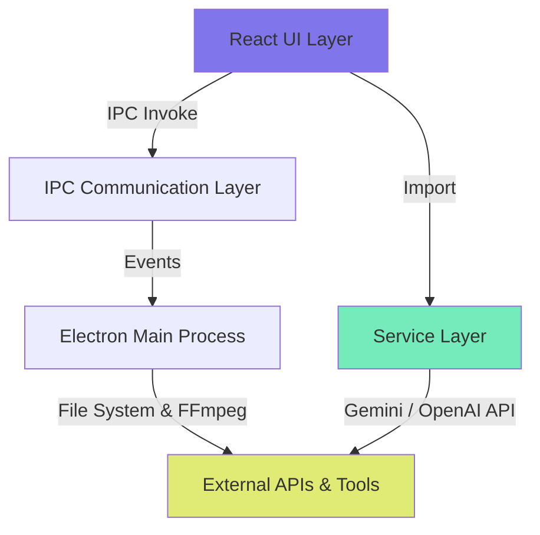

# SUBLIBR - Application Documentation

> **Last Updated**: February 23, 2026
> **Version**: 1.0.0

---

## Table of Contents

1. [Overview](#overview)
2. [Project Structure](#project-structure)
3. [Technical Architecture](#technical-architecture)
4. [Design System](#design-system)
5. [Components](#components)
6. [Services & Processing](#services--processing)
7. [User Experience](#user-experience)
8. [Subtitle Generation Workflow](#subtitle-generation-workflow)

---

## Overview

**SUBLIBR** is a desktop application that generates high-quality subtitles from audio and video files using multiple AI providers (Google Gemini and OpenAI). The app runs as an Electron desktop application, providing a native experience across macOS, Windows, and Linux platforms.

### Key Features

- **Multi-Provider AI Transcription**: Google Gemini and OpenAI with per-provider API key validation and a unified "Active Model" selector
- **Intelligent Audio Processing**: Automatic silence detection and smart chunking (3-4 minute segments with 20s overlap)
- **Gap Healing**: Detects and re-transcribes missing subtitle segments automatically; surfaces a non-blocking warning if healing fails
- **Quality Enforcement**: Ensures subtitles meet display standards configured by **Screen Size** format (Wide: 16:9, Square: 1:1, Vertical: 9:16) with proper durations and max line limits
- **Render Video**: Burns styled subtitles into a video using FFmpeg at any target resolution with real-time progress
- **Global Subtitle Styling**: Full visual style control — font family, font size (ASS PlayRes units), text color, outline/shadow effects, background box, and X/Y position. Includes per-screen-size font defaults and a Reset button
- **Accurate Render Preview**: Subtitle font size in the preview scales proportionally to the render canvas width via `ResizeObserver`, faithfully matching the final burned output across all aspect ratios
- **Recent Files History**: Tracks the last 10 generated or opened files with automatic subtitle caching
- **Token Usage Tracking**: Real-time session token counter with cost estimates and per-provider breakdown
- **Multi-Language Support**: 90+ languages with auto-detection capability
- **Built-in Rich Text Editor**: WYSIWYG editing with bold, italic, underline, and per-word color markup
- **Advanced Timeline Editor**: Two-tier timeline (zoomed main track + full-duration minimap) with ruler, grid, Scissors tool, and drag-to-trim handles
- **Search & Replace**: Global search with highlighting, replacement, and keyboard navigation (Cmd/Ctrl+F)
- **Inline Preview**: Toggle between subtitle editor and video preview (video with overlay or cinema screen for audio)
- **Media Streaming**: Custom `media://` Electron protocol streams files from disk for efficient playback and seeking without loading into memory
- **Versioning & Regenerate**: Create multiple subtitle versions for the same file (different models/prompts) and switch between them instantly
- **Translation**: Translate generated subtitles to another language via text AI while preserving timestamps; creates a new version
- **Auto-Update**: Built-in update system via GitHub Releases with user-controlled download and install

### Tech Stack

| Technology | Purpose |
|------------|---------|
| **Electron** | Desktop application framework |
| **React 19** | UI framework with hooks |
| **TypeScript** | Type-safe development |
| **Vite** | Build tool and dev server |
| **Google Gemini / OpenAI** | Speech-to-text transcription (multi-provider) |
| **FFmpeg** | Audio/video processing (extract audio, detect silences, split chunks, burn subtitles) |
| **electron-store** | Persistent settings storage |
| **fluent-ffmpeg** | Node.js wrapper for FFmpeg |

---

## Project Structure

```
subtitles-gen/
├── electron/                    # Electron main process
│   ├── main.ts                  # Main process with IPC handlers
│   └── preload.ts              # Preload script (bridge API)
│
├── src/                        # React application source
│   ├── components/             # React components
│   │   ├── common/
│   │   │   ├── EditorHeader.tsx     # Shared toolbar for editor & preview
│   │   │   ├── RichTextEditor.tsx   # WYSIWYG contenteditable editor
│   │   │   └── StyledText.tsx       # Read-only styled text renderer
│   │   ├── Timeline/
│   │   │   ├── Timeline.tsx         # Main timeline orchestrator
│   │   │   ├── MainTrack.tsx        # Zoomed detail track (trim, scissors)
│   │   │   ├── Minimap.tsx          # Full-duration overview + scroll window
│   │   │   ├── Ruler.tsx            # Time ruler with comb-style ticks
│   │   │   ├── TimelineGrid.tsx     # Vertical grid lines for alignment
│   │   │   ├── useTimelineTicks.ts  # Shared tick generation logic
│   │   │   └── Timeline.css
│   │   ├── AudioPlayer.tsx
│   │   ├── CustomSelect.tsx         # Portal-based custom dropdown
│   │   ├── FileUpload.tsx
│   │   ├── LanguageSelector.tsx
│   │   ├── ProgressIndicator.tsx
│   │   ├── RecentFiles.tsx
│   │   ├── Settings.tsx
│   │   ├── ShortcutsModal.tsx
│   │   ├── SubtitleEditor.tsx
│   │   ├── SubtitlePreview.tsx      # Video/audio preview with subtitle overlay
│   │   ├── SubtitleStylePanel.tsx   # Global subtitle style controls
│   │   ├── TokenUsageDisplay.tsx
│   │   └── UpdateNotification.tsx
│   │
│   ├── hooks/
│   │   ├── useTranscriptionPipeline.ts  # Full generation/translation/render pipeline
│   │   ├── useKeyboardShortcuts.ts      # Global keyboard shortcuts
│   │   └── useUndoRedo.ts               # Undo/redo history (capped at 50 entries)
│   │
│   ├── services/               # Core business logic
│   │   ├── audioProcessor.ts   # Audio chunking & silence detection
│   │   ├── healer.ts           # Gap detection & healing
│   │   ├── providers.ts        # Multi-provider dispatch, API key testing
│   │   └── transcriber.ts      # AI transcription, quality enforcement, export
│   │
│   ├── prompts/                # AI prompt templates (per provider)
│   │
│   ├── assets/
│   │   └── Fonts/Signika/      # Custom Signika variable font
│   │
│   ├── App.tsx                # Main application component
│   ├── App.css                # Global styles & design tokens
│   ├── types.ts               # TypeScript type definitions
│   ├── utils.ts               # Utility functions
│   └── main.tsx               # React app entry point
│
├── public/
├── dist/                      # Vite build output
├── dist-electron/             # Electron build output
├── release/                   # Packaged installers
│
├── package.json
├── tsconfig.json
├── vite.config.ts
└── README.md
```

---

## Technical Architecture

### Architecture Pattern

The application follows a **layered architecture**:



### 1. **Renderer Process (React UI)**

- **Framework**: React 19 with TypeScript
- **State Management**: Local component state via `useState`/`useEffect` hooks; pipeline logic in `useTranscriptionPipeline`
- **Styling**: CSS-in-file with design tokens (CSS custom properties)

### 2. **IPC Communication Layer**

The app uses Electron's IPC to bridge the renderer and main processes securely. All API calls (transcription, key testing) are proxied through the main process — the renderer never makes direct HTTP requests, keeping API keys invisible in DevTools.

**Preload Script** (`electron/preload.ts`) exposes the full `ElectronAPI`:

```typescript
window.electronAPI = {
  // Settings & Store
  getStoreValue(key),
  setStoreValue(key, value),
  deleteStoreValue(key),

  // File dialogs
  openFileDialog(),
  openSubtitleFileDialog(),
  saveFileDialog(defaultName, filterName?, filterExtensions?),
  showMessageBox(options),

  // File operations
  readFile(path),
  writeFile(path, data),
  getFileInfo(path),
  getTempPath(),
  registerPath(path),          // Security: register path before streaming
  cleanupTempAudio(),          // Remove leftover temp audio files
  getFilePath(file),

  // AI Provider (proxied through main process)
  testApiKey(provider, apiKey),
  callProvider(provider, apiKey, model, prompt, audioBase64, audioFormat?, language?, previousTranscript?),
  callTextProvider(provider, apiKey, model, prompt),

  // FFmpeg operations
  extractAudio(inputPath, outputPath, format?),
  getDuration(filePath),
  detectSilences(filePath, threshold, minDuration),
  splitAudio(inputPath, chunks, format?),
  getVideoInfo(filePath),       // Returns { width, height, duration }
  burnSubtitles(inputPath, subtitleContent, outputPath, targetWidth, targetHeight, subtitleFormat?),

  // Progress events (return cleanup functions)
  onBurnSubtitlesProgress(callback),

  // App updates
  getVersion(),
  checkForUpdates(),
  downloadUpdate(),
  installUpdate(),
  onUpdateAvailable(callback),
  onUpdateProgress(callback),
  onUpdateDownloaded(callback),
  onUpdateError(callback),
}
```

### 3. **Main Process (Electron)**

**File**: `electron/main.ts`

Responsibilities:
- Window management
- IPC handler registration
- File system access (with security validation — path must be registered via `file:registerPath` and have a media/subtitle extension)
- FFmpeg execution (audio extraction, silence detection, splitting, subtitle burning)
- Settings persistence via `electron-store` (keys: `settings`, `subtitle-cache`, `recent-files`, `subtitle-versions`)
- API proxy: all `callProvider` / `callTextProvider` / `testApiKey` calls go through `net.fetch` in the main process
- API key encryption via Electron `safeStorage` (OS keychain); falls back to plaintext if unavailable

**Security Features**:
- Path validation with extension allowlist for media files (`.mp4`, `.mkv`, `.mov`, `.mp3`, `.wav`, etc.) and subtitles (`.srt`, `.vtt`, `.ass`)
- Store key allowlist (`settings`, `recent-files`, `subtitle-cache`, `subtitle-versions`)
- Content Security Policy (CSP) on all windows
- Sandboxed renderer process
- **Media Protocol** (`media://`): Custom Electron protocol streams files from disk with Range request support. Validates paths against registered set before serving.

**Temp File Cleanup**:
- On `before-quit`: deletes all `chunk_*.{flac,mp3}`, `gap_heal_*.flac`, and `subtitles_gen_audio_*` files from the OS temp directory
- On generation failure (`catch`): calls `cleanupTempAudio()` IPC to remove leftover files from the failed run

### 4. **Service Layer**

#### **audioProcessor.ts**
- Chunks audio into 3-4 minute segments
- Detects silence using FFmpeg `silencedetect` filter
- Adds 20-second overlap between chunks
- Sends ~1000 chars of previous transcript as context to the next chunk

#### **transcriber.ts**
- Sends audio chunks to Gemini AI / OpenAI
- Parses timestamped responses into `Subtitle[]`
- Merges subtitles with "smart stitching" (handles chunk boundaries, deduplication, overlap trimming)
- Enforces subtitle quality standards (min/max duration, reading speed, char limits per screen size)
- Exports: `generateSrt`, `generateWebVtt`, `generateAss`, `translateSubtitles`
- `generateAss` accepts `renderResolution: ScreenSize` and `mediaFile` to write the correct `PlayResX/Y` and font size

#### **healer.ts**
- Identifies gaps in subtitle coverage (> 2s, not overlapping detected silences)
- Re-transcribes gap audio segments
- Merges healed subtitles back into timeline; resolves overlaps (original takes priority)

#### **providers.ts**
- Dispatches transcription and text requests to the selected provider
- API key testing via cheapest per-provider endpoints
- Cost calculation from per-model token pricing

### 5. **External Dependencies**

| API/Tool | Purpose |
|----------|---------|
| **Google Gemini API** | Audio transcription + text translation |
| **OpenAI API** | GPT-4o audio transcription + Whisper native transcription |
| **FFmpeg** | Audio extraction, silence detection, splitting, subtitle burning |
| **electron-updater** | Auto-updates via GitHub Releases |

---

## Design System

The app uses a **dark theme** with a modern, premium aesthetic built on design tokens in `src/App.css`.

### Color Palette

```css
/* Background Colors */
--color-bg-primary: #0c0a14;      /* Darkest - main background */
--color-bg-secondary: #13111e;    /* Card backgrounds */
--color-bg-tertiary: #1b1828;     /* Input backgrounds */
--color-bg-hover: #231f33;        /* Hover states */
--color-bg-active: #2d283e;       /* Active states */

/* Accent Colors */
--color-accent: #8075EB;          /* Primary purple */
--color-accent-hover: #9990F0;
--color-accent-dim: rgba(128, 117, 235, 0.15);

/* Semantic Colors */
--color-success: #75EBBB;
--color-warning: #E0EB75;
--color-error: #EB75A5;

/* Text Colors */
--color-text-primary: #f0eef8;
--color-text-secondary: #9b95b8;
--color-text-muted: #6b6488;

/* Borders */
--color-border: #2d283e;
--color-border-focus: #8075EB;
```

### Typography

```css
--font-sans: 'Signika', -apple-system, BlinkMacSystemFont, 'Segoe UI', Roboto, sans-serif;
--font-mono: 'JetBrains Mono', 'Fira Code', monospace;
--font-subtitle: Arial, 'Helvetica Neue', Helvetica, sans-serif;
```

| Font | Usage | Source |
|------|-------|--------|
| **Signika** | Primary UI font | Local variable font file |
| **JetBrains Mono** | Timecodes, monospaced data | Google Fonts |
| **Material Icons Round** | Icon system | Google Fonts |
| **Arial** | Subtitle text display | System font |

### Spacing & Radius

```css
--space-xs: 4px;   --space-sm: 8px;   --space-md: 16px;
--space-lg: 24px;  --space-xl: 32px;  --space-2xl: 48px;

--radius-sm: 6px;  --radius-md: 10px;  --radius-lg: 16px;  --radius-full: 9999px;
```

### Design Notes

- **Dark mode first**: reduces eye strain, premium feel
- **Material Icons Round** used consistently throughout
- **Text selection disabled globally** to prevent accidental UI highlighting; re-enabled for inputs, textareas, and error messages
- **Transitions**: `--transition-fast: 150ms ease`, `--transition-normal: 250ms ease`

---

## Components

All components are **functional React components** using hooks. No class components.

### Component Overview

| Component | File | Purpose |
|-----------|------|---------|
| `App` | `App.tsx` | Root component, orchestrates all state |
| `FileUpload` | `FileUpload.tsx` | Drag-and-drop + file selection + recent files |
| `SubtitleEditor` | `SubtitleEditor.tsx` | Timeline-based subtitle list editor |
| `SubtitlePreview` | `SubtitlePreview.tsx` | Video/audio inline preview with subtitle overlay |
| `SubtitleStylePanel` | `SubtitleStylePanel.tsx` | Global subtitle style controls panel |
| `EditorHeader` | `common/EditorHeader.tsx` | Shared toolbar (undo/redo/formatting/search/count) |
| `RichTextEditor` | `common/RichTextEditor.tsx` | WYSIWYG contenteditable subtitle editor |
| `StyledText` | `common/StyledText.tsx` | Read-only renderer for styled subtitle markup |
| `AudioPlayer` | `AudioPlayer.tsx` | Custom audio playback controls |
| `LanguageSelector` | `LanguageSelector.tsx` | Language picker with autocomplete |
| `CustomSelect` | `CustomSelect.tsx` | Reusable portal-based dropdown |
| `Settings` | `Settings.tsx` | Settings modal (providers, API keys, model) |
| `ShortcutsModal` | `ShortcutsModal.tsx` | Keyboard shortcuts reference modal |
| `ProgressIndicator` | `ProgressIndicator.tsx` | Processing status + progress bar + warning |
| `RecentFiles` | `RecentFiles.tsx` | Recently generated/opened files list |
| `Timeline` | `Timeline/Timeline.tsx` | Two-tier timeline navigation |
| `TokenUsageDisplay` | `TokenUsageDisplay.tsx` | Session token usage badge + popup |
| `UpdateNotification` | `UpdateNotification.tsx` | Auto-update banner |

---

### Detailed Component Descriptions

#### **App (Root Component)**

**Key State**:
```typescript
settings: AppSettings          // Provider config, subtitle style, screen size
mediaFile: MediaFile | null
subtitles: Subtitle[]
versions: SubtitleVersion[]    // Full version history (persisted to subtitle-versions store)
activeVersionId: string | null
editorView: 'subtitles' | 'preview'
renderResolution: ScreenSize   // Independent of settings.screenSize (can differ)
processingState: ProcessingState
recentFiles: RecentFile[]
showStylePanel: boolean
```

**Responsibilities**:
- Load/save settings and recent files from `electron-store` on mount
- Settings migration (v1→v2→v3; v3 resets positionX/Y; fontSize added transparently via spread merge)
- Auto-detect `screenSize` and `renderResolution` from video aspect ratio on file load
- Orchestrate subtitle generation, translation, download, and video render via `useTranscriptionPipeline`
- Persist `versions` to `subtitle-versions` store whenever state changes
- Cache subtitles per media file path; restore on loading recents

**Views**:
1. File upload view (no file selected)
2. Editor view (file selected)
   - Subtitles view (default): subtitle list + timeline
   - Preview view: video/audio with subtitle overlay

---

#### **SubtitlePreview**

**Props**:
```typescript
{
  subtitles: Subtitle[];
  currentTime: number;
  mediaFile: MediaFile;
  subtitleStyle?: SubtitleStyle;
  renderResolution?: ScreenSize;      // 'wide' | 'square' | 'vertical' | 'original'
  onSubtitleChange?: (id, text) => void;
  onUndo?: () => void;
  onRedo?: () => void;
  canUndo?: boolean;
  canRedo?: boolean;
}
```

**Features**:
- **Render canvas**: `<div>` sized to the correct aspect ratio (16/9, 1/1, 9/16, or media native)
- **Video**: muted `<video>` with `object-fit: contain` inside the canvas, loaded via `media://` protocol
- **Audio**: dark "cinema" screen with centered subtitle text
- **Font scaling**: `ResizeObserver` on the canvas div tracks CSS pixel width; `displayFontSize = (style.fontSize / playResX) * canvasPixelWidth` — mirrors the actual ASS render proportions across all aspect ratios
- **Subtitle box**: `width: max-content; max-width: 90%` so the box expands to fit authored lines without collapsing to word-width
- **Inline editing**: click subtitle while paused → `RichTextEditor` opens; save on blur/Enter, cancel on Escape
- **RTL detection**: auto-applies `dir="rtl"` for Hebrew/Arabic
- **Play/pause sync**: listens to the footer `<audio>` element's play/pause events

---

#### **SubtitleStylePanel**

**Props**:
```typescript
{
  style: SubtitleStyle;
  onChange: (style: SubtitleStyle) => void;
  onBack: () => void;
  screenSize?: ScreenSize;    // Used by Reset to pick per-format font default
}
```

**Controls** (in order):
1. **Header row**: Back button + Reset button (both `btn-secondary`)
2. **Live preview** span (`StylePreview`) — shows "Preview Text" with current style applied
3. **Font** — `CustomSelect` dropdown (Arial, Helvetica, Verdana, Georgia, Impact, Courier New)
4. **Font Size** — range slider `20–120` (ASS PlayRes units)
5. **Text Color** — `<input type="color">` + hex display
6. **Effect Mode** — segmented button group: None / Outline / Shadow / Both
7. *(if Outline)* **Outline Color**, **Outline Width** (0.5–5.0 px)
8. *(if Shadow)* **Shadow Color**, **Offset X** (0–10), **Offset Y** (0–10), **Blur** (0–10)
9. **Background Box** — On/Off toggle
10. *(if Background)* **Background Color**, **Opacity** (0–100%)
11. **Horizontal Position** — 0–100%
12. **Vertical Position** — 0–100%

**Reset behavior**: calls `onChange({ ...DEFAULT_SUBTITLE_STYLE, fontSize: SCREEN_SIZE_FONT_DEFAULTS[screenSize] })`

Per-screen-size font defaults (`SCREEN_SIZE_FONT_DEFAULTS`):
| ScreenSize | Default fontSize |
|-----------|-----------------|
| wide | 56 |
| square | 40 |
| vertical | 36 |
| original | 56 |

All changes are saved to `electron-store` immediately by the parent `App.tsx`.

---

#### **EditorHeader** (`common/EditorHeader.tsx`)

Shared toolbar used by both `SubtitleEditor` and `SubtitlePreview`.

**Controls**:
- Left: Search toggle (hidden via `hideSearch`), Auto-scroll checkbox (hidden via `hideAutoScroll`)
- Center: Undo, Redo, **B** (bold), *I* (italic), U (underline) — formatting disabled via `disableFormatting`
- Right: Subtitle count ("N entries")

---

#### **RichTextEditor** (`common/RichTextEditor.tsx`)

WYSIWYG editor for subtitle text (`contenteditable` div).

**Features**:
- Accepts/outputs subtitle markup: `<b>`, `<i>`, `<u>`, `<font color="...">`, `{b}`, `{i}`, `{u}`
- Keyboard shortcuts: Ctrl/Cmd + B/I/U
- `execCommand('bold' | 'italic' | 'underline')` via `useImperativeHandle` ref
- `onStatusChange` reports current selection's bold/italic/underline/size state to `EditorHeader`
- Auto-detects RTL text direction

---

#### **StyledText** (`common/StyledText.tsx`)

Read-only renderer for subtitle markup in the preview.

**Supported tags**: `<b>`, `{b}`, `<i>`, `{i}`, `<u>`, `{u}`, `<font color="#RRGGBB">`, `<font size="1-7">`

Recursive regex parser that produces safe React elements. Does not execute code.

---

#### **CustomSelect**

Portal-based custom dropdown component.

**Implementation**:
- Dropdown `<ul>` rendered via `createPortal(…, document.body)` at `position: fixed`
- Position computed via `triggerRef.getBoundingClientRect()` whenever opened
- Click-outside handler checks both the trigger ref AND the portal `dropdownRef` to prevent premature closing before `click` fires
- Keyboard: ArrowUp/ArrowDown cycle options, Enter confirms, Escape closes
- ARIA: `role="combobox"` trigger, `role="listbox"` + `role="option"` items, `aria-selected`

---

#### **Timeline**

**Files**: `Timeline/` directory (7 files)

**Features**:
- **Two-Tier System**:
  - **MainTrack**: Zoomed detail view; subtitle blocks with drag handles for trim; click to seek
  - **Minimap**: Full-duration overview with dual-handle scroll window for zooming and panning
- **Ruler**: Comb-style time ticks adapting to zoom level
- **Grid**: Vertical lines extending from major ticks
- **Tools**: Select (default), Scissors (C key — split at playhead), Trim (drag block edges)
- **Sync**: Playhead synced across both tracks; `useTimelineTicks` shared logic

---

#### **ProgressIndicator**

**Props**:
```typescript
{
  state: ProcessingState;
  providerLabel?: string;
  onRetry?: () => void;
  onDismiss?: () => void;
}
```

**Display logic**:
- `status === 'idle'`: hidden
- `status === 'done' && !warning`: hidden
- `status === 'done' && warning`: shows yellow warning box (non-fatal, e.g. healing failed)
- All other statuses: shows progress bar + status message + optional chunk counter
- `status === 'error'`: shows error message + Retry/Dismiss buttons

**Status messages**:
| Status | Message |
|--------|---------|
| extracting | Extracting audio... |
| detecting-silences | Detecting silences... |
| splitting | Splitting audio into chunks... |
| transcribing | Transcribing with {providerLabel}... |
| merging | Merging subtitles... |
| healing | Healing gaps... |
| rendering | Burning subtitles into video... |
| done | Complete! |
| error | Error occurred |

---

#### **AudioPlayer**

Exposes `seek(time)` and `togglePlay()` via `forwardRef`/`useImperativeHandle`.

**Features**:
- HTML5 `<audio>` loaded via `media://` protocol
- Custom play/pause, skip ±5s, volume slider, progress bar
- Filename displayed centered; auto-scroll marquee on hover for long names
- Time display: `[00:00]  [Filename]  [05:35]`

---

#### **Settings**

**Layout**:
1. **Active Model Hero** — accent-bordered `CustomSelect` listing all models from enabled providers. Shows info banner when no keys are configured.
2. **Provider Cards** (Gemini, OpenAI) — toggle, API key input, Test button with status indicator (valid/invalid/testing), link to provider console
3. **Save** — disabled until active provider's key is verified

**Key Testing**: uses cheapest per-provider endpoints (`GET /v1beta/models` for Gemini, `GET /v1/models` for OpenAI).

---

## Services & Processing

### providers.ts

##### `callProvider(provider, apiKey, model, prompt, audioBase64, audioFormat?, language?, previousTranscript?)`
Proxied through main process. Returns `ProviderResponse` with text and `TokenUsage`.

##### `callTextProvider(provider, apiKey, model, prompt)`
Text-only call (translation, language detection). Also proxied.

##### `testApiKey(provider, apiKey)`
Returns `{ ok: boolean, error?: string }`.

**Exports**: `PROVIDER_LABELS`, `MODEL_OPTIONS`, `PROVIDER_KEY_URLS`, `MODEL_PRICING`, `calculateCost(tokenUsages)`

---

### audioProcessor.ts

**Main Function**: `createAudioChunks(audioPath, tempDir, format)`

**Process**:
1. Get total duration via `ffprobe`
2. Detect silences (`-25dB` threshold, `0.3s` min duration)
3. Calculate chunk boundaries (target 210s, min 180s, max 240s, 20s overlap)
4. Split at silence closest to target boundary
5. Extract chunks (FLAC for Gemini, MP3 for OpenAI)

---

### transcriber.ts

**Main Functions**:

##### `transcribeChunk(chunk, apiKey, model, language, autoDetect, screenSize, previousTranscript?)`
- Converts chunk to base64
- Sends to AI with appropriate prompt template
- Parses response into `Subtitle[]`
- Applies `startTime` offset

**Quality Enforcement Constants**:
```typescript
MIN_DURATION: 1.0s    MAX_DURATION: 7.0s    MIN_READING_SPEED_CPS: 12
MAX_CHARS_PER_LINE varies by screen size: wide=40, square=25, vertical=15
MAX_LINES: 2
```

##### `mergeSubtitles(allSubtitles)`
Smart stitching: deduplication by text similarity (>80%) in overlap zones; overlap trimming; minimum 0.05s gap enforcement.

##### `enforceSubtitleQuality(subtitles)`
Post-processing: merge short subtitles (gap < 1s), extend durations, cap at 7s, remove degenerate entries.

##### `generateSrt(subtitles)` / `generateWebVtt(subtitles)`
Standard export with source tag stripping.

##### `generateAss(subtitles, style, renderResolution, mediaFile?)`
```typescript
generateAss(
    subtitles: Subtitle[],
    style: SubtitleStyle = DEFAULT_SUBTITLE_STYLE,
    renderResolution: ScreenSize = 'wide',
    mediaFile?: Pick<MediaFile, 'width' | 'height'>,
): string
```
- `PlayResX/Y` derived from `getPlayRes(renderResolution, mediaFile.width, mediaFile.height)`
- `Fontsize` = `style.fontSize` (integer)
- Position tag: `\an2\pos(posX, posY)` — coordinates as % of PlayResX/Y
- Colors: hex → `&HAABBGGRR` (ASS BGR format)
- `BorderStyle 3` (background box) or `1` (outline+shadow)

##### `translateSubtitles(subtitles, targetLanguage, provider, apiKey, model, onProgress?)`
Chunked translation (3000 chars/chunk), preserves timestamps, returns new `Subtitle[]` + `TokenUsage`.

---

### healer.ts

**Main Function**: `healSubtitles(subtitles, audioPath, silences, ...)`

1. Find gaps > 2s not covered by ≥80% silence
2. Extract gap audio (±0.5s buffer)
3. Re-transcribe each gap
4. Merge into original timeline (original takes priority on overlap)

---

## User Experience

### Keyboard Shortcuts

| Shortcut | Action | Context |
|----------|--------|---------|
| `Cmd/Ctrl+S` | Download subtitles | Editor |
| `Cmd/Ctrl+Z` | Undo | Editor |
| `Cmd/Ctrl+Shift+Z` | Redo | Editor |
| `Cmd/Ctrl+F` | Toggle search | Editor |
| `Space` | Play / Pause | Global |
| `←` / `→` | Seek ±5s | Global |
| `Alt+N` / `I` | Insert subtitle at current time | Editor |
| `Alt+Backspace` / `Del` | Delete selected subtitle | Editor |
| `C` | Scissors tool | Timeline |
| `V` | Select tool | Timeline |
| `T` | Trim tool | Timeline |
| `Cmd/Ctrl+O` | Open file | Home |
| `↑` / `↓` | Navigate recent files | Home |
| `Enter` | Select recent file | Home |
| `Escape` | Close modal / cancel | Global |

### Accessibility

- **Modals**: `role="dialog"`, `aria-modal`, focus trap (Tab cycles within), Escape to close, focus restoration
- **Custom Select**: `role="combobox"` / `role="listbox"` / `role="option"`, `aria-expanded`, keyboard navigation
- **Progress Indicator**: `role="progressbar"`, `aria-valuenow/min/max`, `aria-live="polite"`, `role="alert"` on errors and warnings
- **Audio Player**: progress bar as `role="slider"`, `aria-label` on all icon-only buttons
- **Subtitle Editor**: `role="list"`, `aria-label` on time inputs and delete buttons
- **Subtitle Preview**: `aria-live="polite"` on subtitle text
- **File Upload**: drop zone as `role="button"`, `role="alert"` on errors

### User Workflow

```
Launch App
  → Configure API key (Settings)
  → Drop or select media file
  → Choose language + screen format
  → Generate Subtitles
      → Extract audio → Detect silences → Split into chunks
      → Transcribe chunks → Merge & stitch → Enforce quality → Heal gaps
  → Review in editor / Preview tab
  → Adjust Global Style (font, size, color, effects, position)
  → Download (SRT/VTT/ASS) or Render Video
```

### Error Handling

| Error | Display | Recovery |
|-------|---------|----------|
| Missing API Key | Yellow warning banner | Directs to Settings |
| Invalid API Key | Red X + error text | Re-enter and Test |
| Invalid File | Red error message | Select different file |
| Transcription Failure | Error progress state + Retry button | Retry or dismiss |
| Healing Failure | Yellow warning on "done" state | Non-blocking; subtitles still available |
| Render Failure | Error progress state | Dismiss and retry |
| FFmpeg Error | Technical error message | Shown for debugging |

---

## Subtitle Generation Workflow

### High-Level Pipeline

```
Audio/Video File
  ↓ Extract Audio (FLAC/MP3)
  ↓ Detect Silences
  ↓ Split into Chunks (3-4 min, 20s overlap)
  ↓ Transcribe Each Chunk (Gemini / OpenAI)
  ↓ Parse → Subtitle Objects
  ↓ Merge & Stitch Chunks
  ↓ Enforce Quality Standards
  ↓ Heal Gaps
  ↓ Final Subtitle Set → Display in Editor
```

### Step Details

**Step 1 — Extract Audio**
FFmpeg → FLAC (Gemini) or MP3 (OpenAI), mono 16kHz. Temp file cleaned up on success or failure.

**Step 2 — Detect Silences**
`ffmpeg -af silencedetect=noise=-25dB:d=0.3 -f null -` → parses `silence_start`/`silence_end` lines.

**Step 3 — Split**
Target 210s; split at nearest silence to target; 20s overlap; previous ~1000 chars of transcript sent as context to next chunk.

**Step 4 — Transcribe**
Audio chunk → base64 → AI provider. Prompt enforces screen-size char/line limits. Offset timestamps by `chunk.startTime`.

**Step 5 — Parse**
SRT blocks (Gemini/GPT), word-level JSON (Whisper), or timestamped text parsed into `Subtitle[]`.

**Step 6 — Merge**
Pairwise stitching with deduplication (text similarity > 80%) and overlap trimming.

**Step 7 — Enforce Quality**
Min 1s duration, max 7s, min reading speed, merge consecutive short subs, extend short into gaps.

**Step 8 — Heal Gaps**
Any gap > 2s not covered by silence → re-transcribe → insert. Failure surfaced as a non-blocking warning.

### Processing Time Estimates

| File Duration | Chunks | Approx. Total Time |
|---------------|--------|-------------------|
| 5 min | 2 | ~1 min |
| 15 min | 5 | ~2.5 min |
| 30 min | 9 | ~5 min |
| 60 min | 18 | ~10 min |

---

## Appendix

### Type Definitions

```typescript
// src/types.ts

export interface Subtitle {
  id: string;           // crypto.randomUUID()
  index: number;
  startTime: number;    // seconds
  endTime: number;
  text: string;         // may include <b>, <i>, <u>, <font color="..."> markup
}

export interface SubtitleVersion {
  id: string;
  timestamp: number;
  provider: AIProvider;
  model: string;
  language: string;
  subtitles: Subtitle[];
  label?: string;       // e.g. "V1-English_Auto, gemini-2.5-flash"
}

export type ProcessingStatus =
  | 'idle' | 'extracting' | 'detecting-silences' | 'splitting'
  | 'transcribing' | 'merging' | 'healing' | 'rendering' | 'done' | 'error';

export interface ProcessingState {
  status: ProcessingStatus;
  progress: number;         // 0–100
  currentChunk?: number;
  totalChunks?: number;
  error?: string;
  warning?: string;         // Non-fatal (e.g. healing step failed)
}

export type AIProvider = 'gemini' | 'openai';

export type ScreenSize = 'wide' | 'square' | 'vertical' | 'original';

export interface SubtitleStyle {
  fontFamily: string;       // 'Arial', 'Helvetica', etc.
  fontSize: number;         // ASS PlayRes units (default 56 at PlayResX=1920)
  textColor: string;        // '#FFFFFF'
  outlineMode: 'none' | 'outline' | 'shadow' | 'both';
  outlineColor: string;
  outlineWidth: number;     // 0.5–5.0
  shadowColor: string;
  shadowOffsetX: number;
  shadowOffsetY: number;
  shadowBlur: number;
  backgroundEnabled: boolean;
  backgroundColor: string;
  backgroundOpacity: number; // 0–1
  positionX: number;         // 0–100 (% from left)
  positionY: number;         // 0–100 (% from top)
}

export const DEFAULT_SUBTITLE_STYLE: SubtitleStyle = {
  fontFamily: 'Arial', fontSize: 56, textColor: '#FFFFFF',
  outlineMode: 'both', outlineColor: '#000000', outlineWidth: 1.0,
  shadowColor: '#000000', shadowOffsetX: 1, shadowOffsetY: 1, shadowBlur: 0,
  backgroundEnabled: false, backgroundColor: '#000000', backgroundOpacity: 0.8,
  positionX: 50, positionY: 85,
};

export const SCREEN_SIZE_FONT_DEFAULTS: Record<ScreenSize, number> = {
  wide: 56, square: 40, vertical: 36, original: 56,
};

// Returns [PlayResX, PlayResY] for ASS and preview font scaling
export function getPlayRes(screenSize: ScreenSize, mediaWidth?, mediaHeight?): [number, number];

export interface AppSettings {
  activeProvider: AIProvider;
  providers: Record<AIProvider, ProviderConfig>;
  language: string;
  autoDetectLanguage: boolean;
  screenSize: ScreenSize;
  subtitleStyle: SubtitleStyle;
  settingsVersion?: number;   // Migration flag (current: 3)
}

export interface MediaFile {
  path: string; name: string; ext: string;
  size: number; duration: number; isVideo: boolean;
  width?: number; height?: number;
}
```

### Settings Migration

| Version | Change |
|---------|--------|
| 1 | Flat `apiKey` → `providers` object per provider |
| 2 | Added `screenSize` |
| 3 | Reset `positionX/Y` to defaults (previous saves had stale values) |
| — | `fontSize` added transparently via `{ ...DEFAULT_STYLE, ...savedStyle }` spread |

### Build & Deployment

```bash
npm run dev              # Dev: Vite + Electron with hot reload
npm run build:electron   # Production: build + package installers
```

**Targets**: macOS (DMG), Windows (NSIS x64), Linux (AppImage x64)

FFmpeg and ffprobe binaries bundled via `extraResources` in electron-builder config; paths resolved dynamically based on `app.isPackaged`.

---

### Feature Status

#### Completed
- [x] AI transcription (Gemini + OpenAI) with multi-provider selection
- [x] Subtitle export: SRT, WebVTT, ASS
- [x] Render video (burn subtitles via FFmpeg)
- [x] Global subtitle styling (font, size, color, outline, shadow, background, position)
- [x] Per-screen-size font size defaults and Reset button
- [x] Accurate render preview (ResizeObserver font scaling per aspect ratio)
- [x] Keyboard shortcuts (playback, editing, undo/redo, search)
- [x] Advanced timeline (ruler, grid, minimap, scissors, trim)
- [x] Translation pipeline with version history
- [x] Session token usage tracking with cost estimates
- [x] Auto-update via GitHub Releases
- [x] Inline preview with WYSIWYG subtitle editing
- [x] Subtitle caching and recent files with restoration
- [x] Accessibility (ARIA, focus traps, keyboard navigation, live regions)
- [x] API keys encrypted at rest via Electron `safeStorage`
- [x] Custom `media://` protocol for large file streaming
- [x] Per-run temp file cleanup on failure
- [x] Non-blocking healing failure warning
- [x] Portal-based CustomSelect (no sidebar overflow clipping)

#### Under Consideration
- [ ] Multi-track subtitles (multiple languages)
- [ ] Speaker diarization
- [ ] Waveform visualization for audio files
- [ ] Batch processing
- [ ] Custom AI prompt templates

---

## Credits

**Application**: SUBLIBR
**Version**: 1.0.0
**License**: MIT License (Copyright © 2026)
**Developed by**: Stas Krylov

**Tech Stack**: Electron · React · TypeScript · Vite · Google Gemini · OpenAI · FFmpeg

**Acknowledgments**: Built with the assistance of Anthropic's Claude Sonnet and Google's Gemini models.

---

*End of Documentation*
