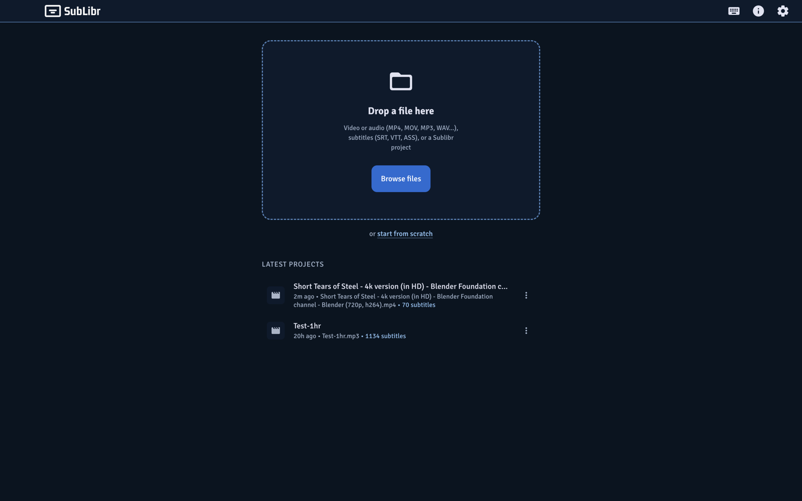
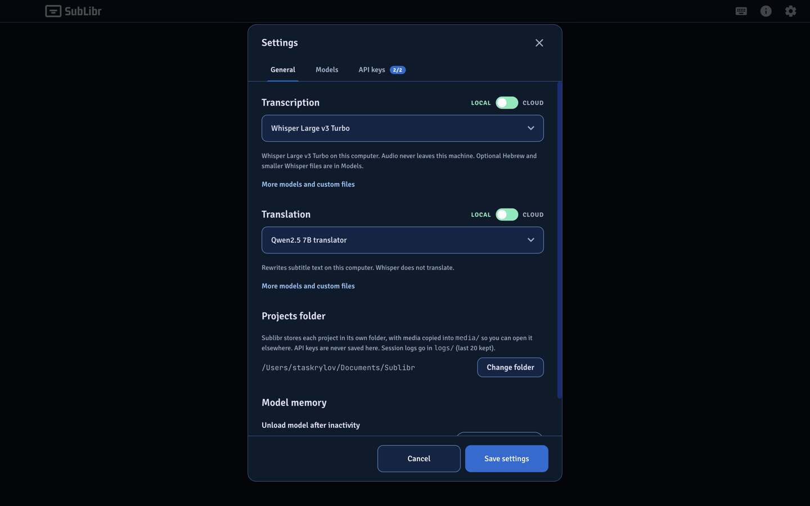
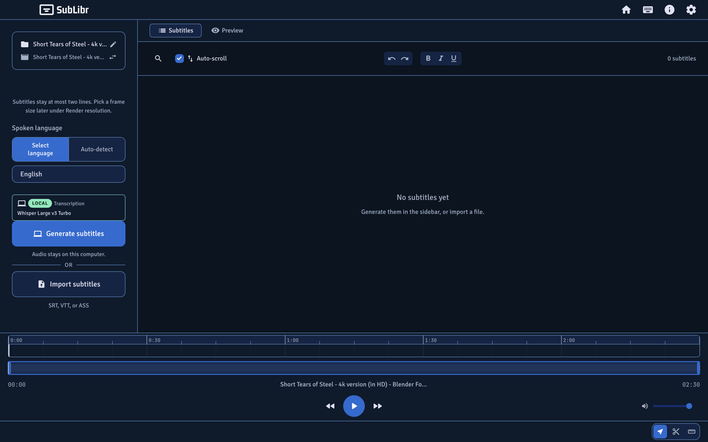
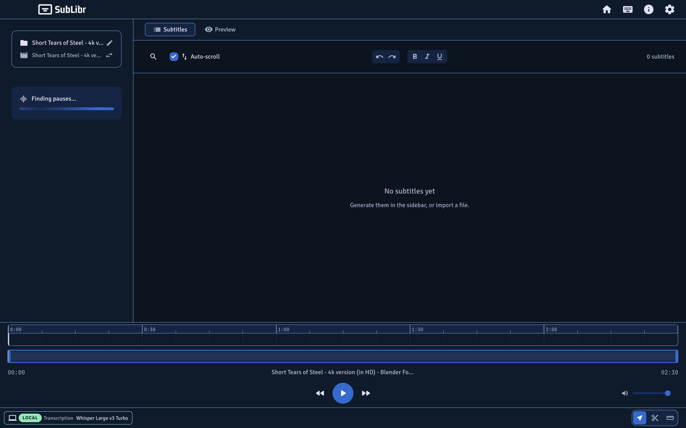
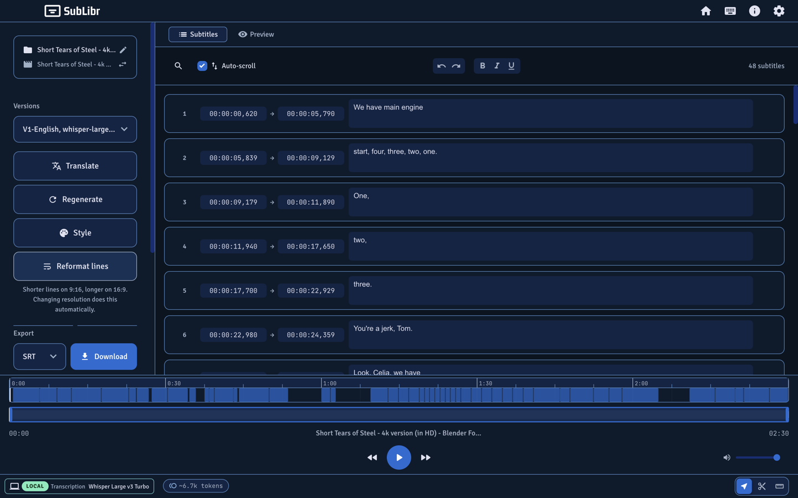
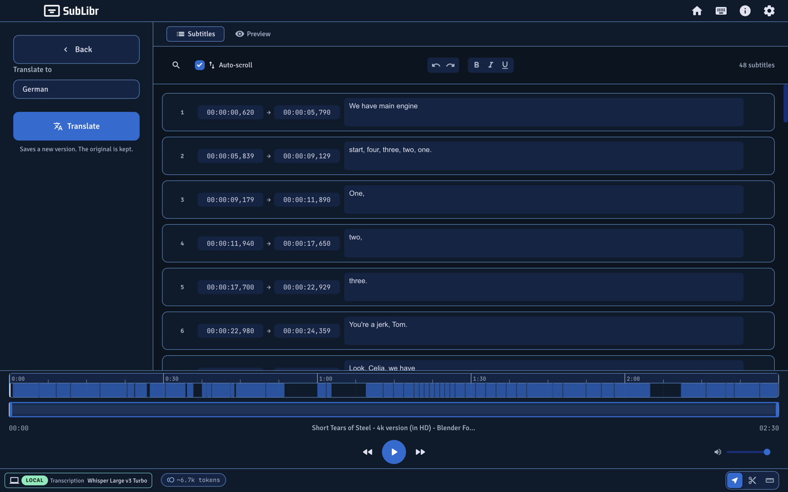
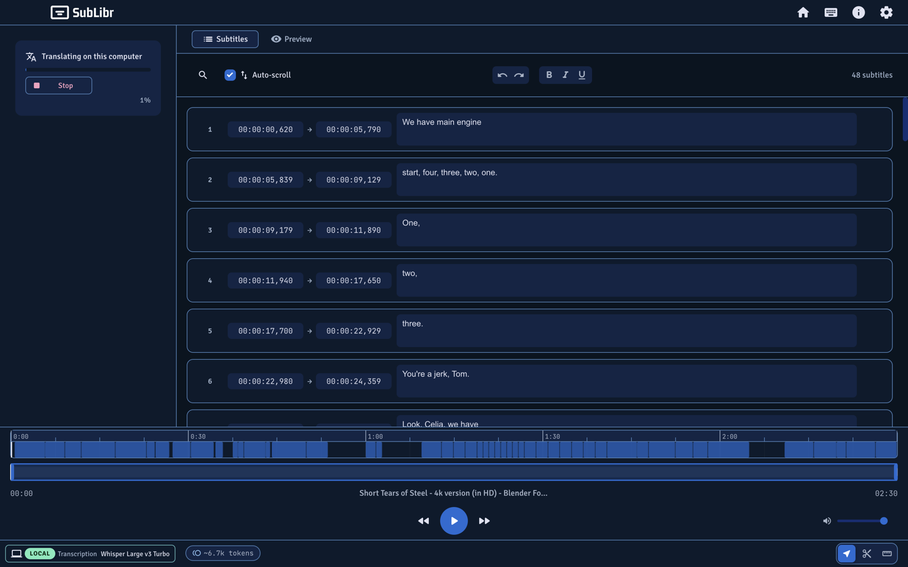
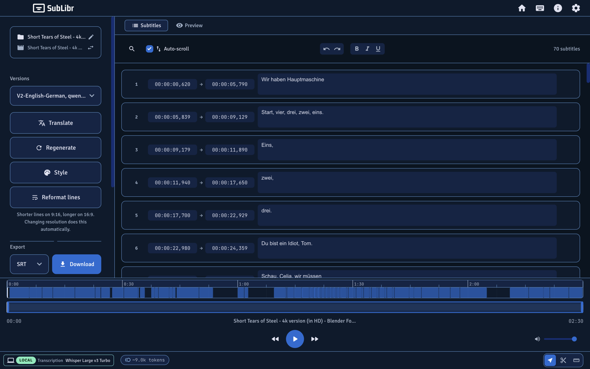
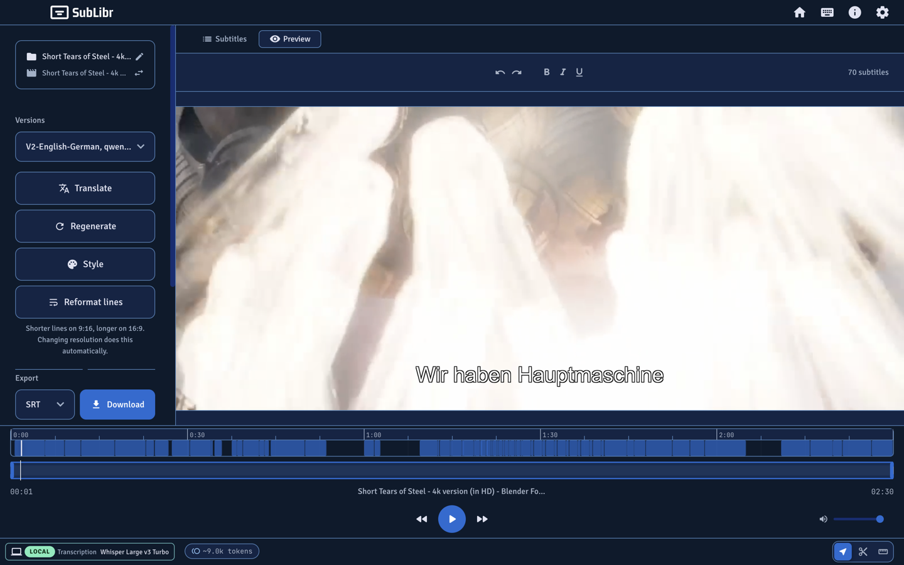

# SUBLIBR


A desktop app that turns video and audio into **timed subtitles**. Transcribe locally or in the cloud, edit on a timeline, style the text, and export files or a burned-in video.

תוכנה שולחנית לתמלול וידאו ואודיו לכתוביות עם חותמות זמן. אפשר לעבוד לגמרי במחשב (Whisper, כולל משקלי ivrit.ai לעברית) או בענן (Gemini / OpenAI).

## Screenshots

Local Whisper transcription of a short English clip, then Qwen translation to German. Window is 1440×900.

| | |
|---|---|
|  |  |
|  |  |
|  |  |
|  |  |



## Features

**Transcription, with timestamps.** Sublibr only uses speech models that return times. Cloud: Gemini 3.5 Transcribe, or OpenAI Whisper (`whisper-1`). Local: Whisper Large v3 Turbo via `whisper-cli` (99 languages). Optional Hebrew (ivrit.ai) and smaller Whisper sizes are a pick in Settings → Models — Turbo is the default for every language, including Hebrew, unless you choose otherwise.

**Translation.** Rewrite subtitle text while keeping the same cues. Cloud: Gemini (Flash or Pro) or GPT-4o / GPT-4o Mini. Local: Qwen2.5 via `llama-server` (7B by default, optional 3B). You can add an instruct GGUF (Qwen, Llama, or Gemma) in Models. Whisper does not translate. Request templates are not user-editable. Each translation is saved as a new version.

**Portable projects.** Each job is a folder (default `~/Documents/Sublibr`). Media is copied into `media/` so you can move the folder to another computer. Files up to 3 GB. Latest projects on the home screen: open, rename, duplicate, delete, or relink missing media. Drop or browse a video, audio file, SRT/VTT/ASS, or a Sublibr project. Start from scratch when you have no file yet. Replace media from the editor sidebar.

**Editor.** Subtitles list and Preview. Two-tier timeline (detail + minimap), select / scissors / trim, search and replace, undo/redo, and inline rich text (bold, italic, underline, per-word color). RTL typography for Hebrew and similar scripts. Auto-scroll to the active cue. Versions keep a transcription so you can translate or regenerate without losing the previous pass. Reformat lines for the current frame size.

**Style and output.** Per-project style: font, size, color, outline, shadow, box, position (title-safe by default). Screen format (wide 16:9, square, vertical, original) drives line length, preview, and render size. Download SRT, WebVTT, or ASS. Burn styled subtitles into a video.

**Long files.** Splits audio into overlapping parts, stitches at boundaries, then fills gaps the model skipped (you can skip that step). Pause and resume transcription. Cloud runs show session token usage.

**Local / Cloud.** Settings → General has a Local / Cloud toggle for Transcription and for Translation. Cloud options appear after you test a key on the API keys tab. Local is enabled only when Whisper is installed and probed.

**Private by design.** API keys live in OS-encrypted electron-store, never in the project folder. Local audio never leaves this machine. Cloud runs send audio to Google or OpenAI under those providers’ terms. Session logs (no secrets) sit in each project’s `logs/` folder, last 20 kept.

**Updates.** Packaged builds can download an update from GitHub Releases and restart to install.

## Getting started

### Prerequisites

- **Node.js** 18 or newer
- For **cloud** transcription or translation: a [Google AI Studio](https://aistudio.google.com/apikey) key and/or an [OpenAI](https://platform.openai.com/api-keys) key
- For **local** transcription and translation, see [Local models](#local-models). Homebrew is required for `whisper-cli` / `llama-server`; Sublibr does not install Homebrew itself.

### Run from source

```bash
git clone https://github.com/stskr/sublibr.git
cd sublibr
npm install
npm run dev
```

If Electron exits immediately in Cursor, the shell is injecting `ELECTRON_RUN_AS_NODE=1`. Clear it:

```bash
ELECTRON_RUN_AS_NODE= npm run dev
```

First launch asks where to store projects (suggested: `Documents/Sublibr`). Then Settings → **API keys** to test a cloud key, or General → **Local** and **Set up offline**.

### Production build

```bash
# macOS
npm run build:electron

# Windows
npm run build && npx electron-builder --win

# Linux
npm run build && npx electron-builder --linux
```

### Tests

```bash
npx vitest run
```

## How to use

1. **Open something.** Drop or browse video/audio, a subtitle file, or a project folder / `project.sublibr`. Or start from scratch and add media later.
2. **Choose a model.** Settings → General: Local or Cloud for transcription (and separately for translation). Cloud options appear after a key is tested. The generate panel opens Settings → General.
3. **Generate subtitles.** Pick a language (or auto-detect) and Generate. Local is enabled only when Whisper is actually installed and probed. Audio stays on this computer in Local mode.
4. **Edit.** Subtitles list, Preview, or the timeline. Style, Translate, or Regenerate; the current version is kept. Reformat lines if you change the frame size.
5. **Export.** Download SRT / VTT / ASS, or Render video to burn the styled track in.

Settings tabs: **General** (Local/Cloud pickers, projects folder, model memory), **Models** (downloads and custom files), **API keys**.

## Local models

Settings → General → **Local**. If anything is missing, **Set up offline** lists exactly what will be installed and waits for a consent checkbox. Already-present tools and files are skipped. Homebrew packages (`whisper-cpp`, `llama.cpp`) are installed only when `whisper-cli` / `llama-server` are missing. Whisper Large v3 Turbo (and Qwen 7B if translation is also Local) download from Hugging Face into a local `models/` folder (dev: repo root; packaged app: the app’s user-data folder).

| Default local stack | File / tool | Used for |
|----------|------|----------|
| whisper-cli | Homebrew `whisper-cpp` | Timestamped transcription |
| llama-server | Homebrew `llama.cpp` | Local translation |
| Whisper Large v3 Turbo | `ggml-large-v3-turbo-official.bin` | 99 languages |
| Qwen2.5 7B translator | `Qwen2.5-7B-Instruct-Q4_K_M.gguf` | Local translation |

Settings → **Models** has Hebrew Whisper (ivrit.ai), smaller official Whisper sizes, a 3B Qwen translator, and **Add Whisper file** / **Add translator GGUF**. Files are inspected before they are listed (whisper.cpp ggml/GGUF, or a Qwen/Llama/Gemma instruct GGUF). Sublibr points at your path; it does not copy the file. Remove forgets it in Settings and does not delete the file.

The translator unloads after a few idle minutes (configurable in General → Model memory; Never keeps it until quit). Whisper unloads after each clip.

## Project folder

```
Documents/Sublibr/
  My Video/
    project.sublibr      # JSON manifest (relative paths)
    media/               # collected copy of the source file
    subtitles.json
    versions.json
    logs/                # session-YYYYMMDD-HHMMSS.jsonl
```

Identity is the **folder**, not an absolute media path. Opening a legacy `project.json` migrates to `project.sublibr`. API keys are never written here.

## Tech stack

Electron, React 19, TypeScript, Vite, FFmpeg. Cloud: Google Gemini, OpenAI. Local: whisper.cpp, llama.cpp. Settings in electron-store. Auto-update via electron-updater.

## License

MIT — see [LICENSE](LICENSE). FFmpeg is LGPL 2.1+; source at [ffmpeg.org/download](https://ffmpeg.org/download.html).

You are responsible for having the right to transcribe, subtitle, and distribute any media you process.
